# Career Model

- [Roles and Responsibilies Slides](https://sinewgroupltd-my.sharepoint.com/:p:/g/personal/ndunlop_robiquity_com/EQFJfpe6NG9KuU0RL_f8XkIB5yXVJQoLY3Hs7cr1Wd1FRw?e=UI4INb)

## Overview

It takes a lot of amazing people with a blend of skills and abilities to make an excellent team, and each of those amazing people needs to be clear on what is expected of them and what they can expect of others to do a good job. That’s where roles and responsibilities come in.

## Introduction

Your career is, for most people, one of the most important things in their life. You spend more time working than a significant proportion of other, arguably more important, things. 

We want your time at Robiquity to be more than a series of tasks. We’d like everyone to have a fulfilling job, and in some cases, a series of fulfilling jobs.

For people to feel like Robiquity is a company worth working for and offers them more than just a job, we’ve got some important questions to answer. The purpose of this deck is to answer those questions. 

Like everything at Robiquity, it’s not set in stone and will evolve over time in response to the challenges we face and the response we get from our team.

### Questions to be answered

This document has four main objectives:

* **What are the levels of seniority in the business?**
    * Where does our career model start and how high does it go?

* **What are the roles that I can take on within the business?**
    * What do I do in those roles?
    * What are my options for progression in those roles?

* **Expectations, Progression and Performance Reviews**
    * What are the expectations at each level and in each role?
    * What are the attributes that make a good member of the Robiquity team?
    * How and when do a I progress through roles and levels?

* **How are teams structured?**
    * Who will I typically work with?
    * Who is my ‘boss’?
    * Who can I call on for help and support?

## Career Levels

Everyone in the business, regardless of what they do for a day job, has one of six levels of seniority. 

As you increase in capability and experience you will move up the levels and take on more, and different kinds of responsibility, and see an increase in your pay.

Regardless of role, consultants of the same level have the same seniority and influence within Robiquity. We work as a collaborative, multi-functional team to get the job done.

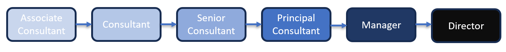

## Roles
Roles describe the job a team member does every day. To make things a little simpler we’ve grouped similar roles together in functions. These functions reflect what we do now and may change in the future.

### Technology Roles
In Technology, when you’re at the Associate Consultant level you’ll start as a **Developer**. As your skills and capabilities grow, you’ll be promoted to Consultant and subsequently to Senior Consultant.

At Senior Consultant level you’ll have the choice of taking on the **Technology Lead** role in some engagements.

Once you get to Principal level, you’ll have gained enough experience to have the opportunity to apply for a **Solution Architect** or **Practice Lead** role.

Alternatively, you can stay in the Developer role throughout your tenure.

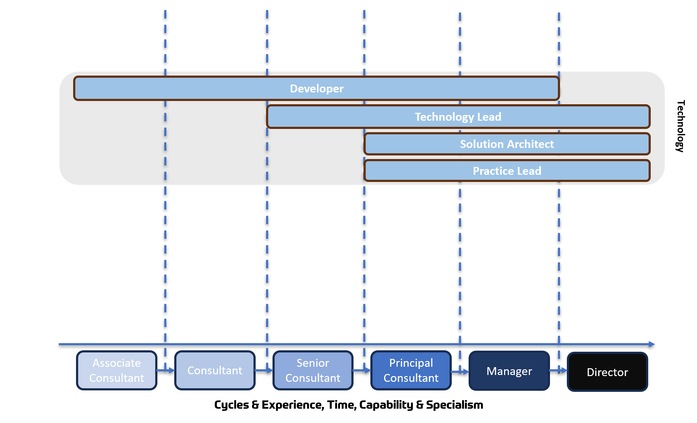

### Discovery and Analysis Roles
In the Discovery and Analysis function, the **Discovery Analyst** role starts at the Consultant level. 

As your skills and capabilities grow, you’ll be promoted to Senior Consultant where you’ll have the choice of taking on the **Discovery Lead** role in some engagements.

Alternatively, you can stay in the **Discovery Analyst** role throughout your tenure.

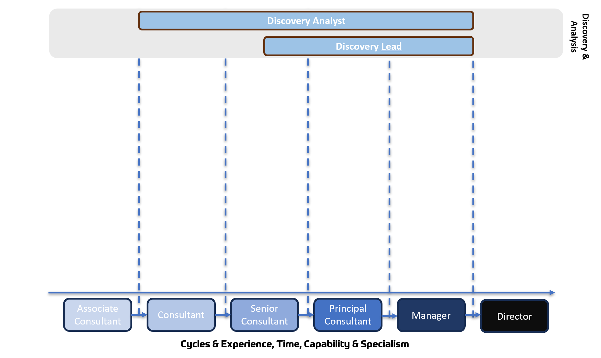

### Managed Service Roles
In Managed Service, when you’re at the Associate Consultant level you’ll start as a **Support Analyst**. As your skills and capabilities grow, you’ll be promoted to Consultant and subsequently to Senior Consultant.

At the Senior Consultant level, you’ll have gained enough experience to have the opportunity to take on a **Service Manager** role.

Alternatively, you can stay in the **Support Analyst** role throughout your tenure.

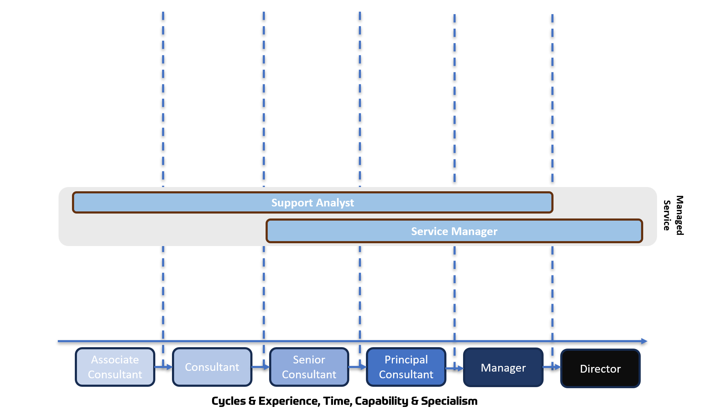

### Delivery Roles
In Delivery, when you’re at the Associate Consultant level you’ll start as a **PMO**. As your skills and capabilities grow, you’ll be promoted to Consultant

At the Senior Consultant level, you’ll have gained enough experience to take on a **Delivery** Lead role.

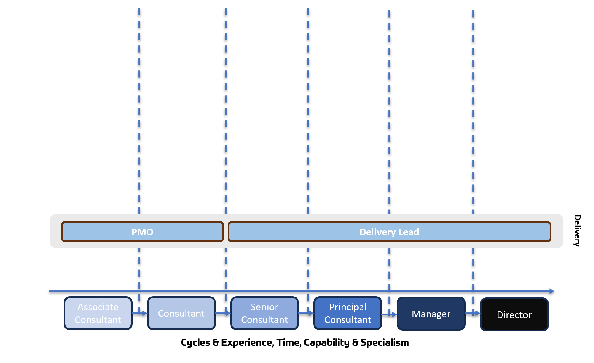

### Sales Roles
In Sales, when you’re at the Associate Consultant level you’ll start as a **Business Development Representative**. As your skills and capabilities grow, you’ll be promoted to Consultant and subsequently Senior Consultant.

At the Principal Consultant level, you’ll have gained enough experience to take on a **Sales Manager** role.

At the Manager level, you’ll have gained enough experience to take on a **Client Partner** role.

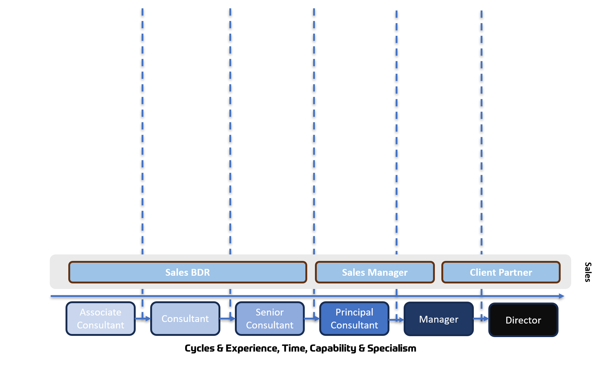

### Moving Between Functions

Early in their careers, it’s relatively easy and highly beneficial for staff to move between functions and try out other roles.

It’s not unheard of for Associate Consultants to start in a Developer role and then decide to move into the Support Analyst, PMO or Sales BDR roles. 

At the Senior Consultant level, it’s common for Technology Leads to pick up enough skills to cover parts of the Delivery Lead role or Discovery Lead roles, and occasionally vice-versa.

As people progress to the Principal Consultant level they start to specialise and generally stick to the Lead role in their function, investing deeply in the skills and capabilities needed for that role.

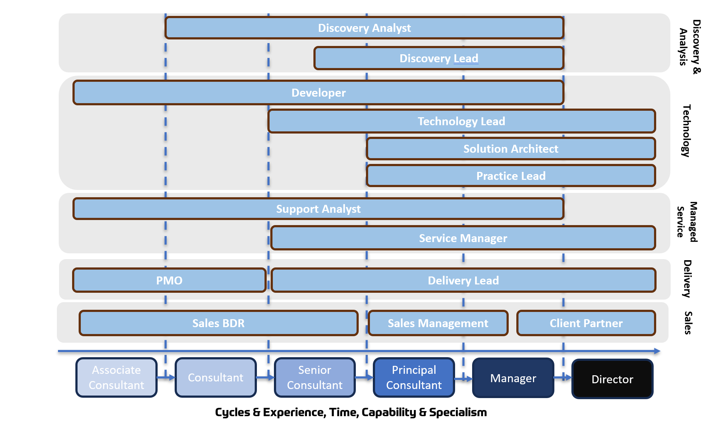

## Expectations

### Overview
There are two things that define what is expected of Robiquity team members. They are both tied to our core Robiquity values.

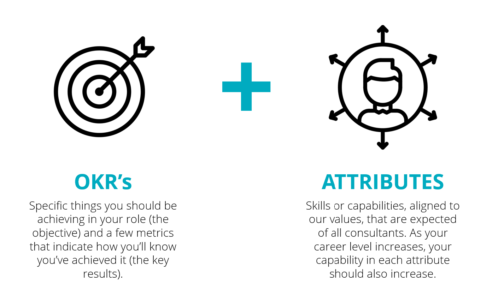

**Attributes** describe skills or capabilities that are expected of all consultants. As your career level increases, your capability in that attribute should also increase.

**Objectives** and Key Results (OKR’s) describe what you should be aiming to achieve in your role (the objective) and a few metrics that describe how you’ll know you’ve achieved it (the key results).

Attributes are general things that apply to all staff, regardless of level and are how you demonstrate your growing experience and capability.  OKR’s are how you demonstrate your ability in your specific role.

### Attributes
Attributes describe skills or capabilities that are expected of all consultants. As your career level increases, your capability in that attribute should also increase.

Attributes are general things that apply to all staff, regardless of level and are how you demonstrate your growing experience and capability.  

The attributes are:
* **Building Great Relationships**
* **Analysing and Deciding**
* **Leadership**
* **Applying Business Sense**
* **Embracing Change and Uncertainty**
* **Skilled and Capable**

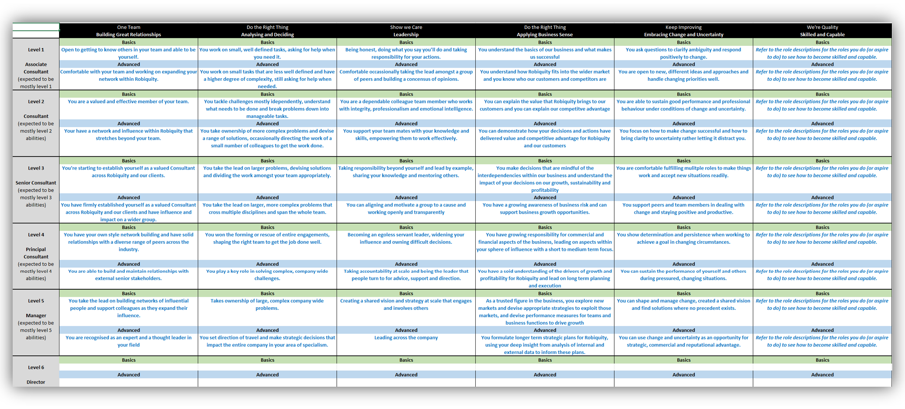
**You can see more about the [Robiquity Core Attributes](2-attributes.md) by following this link.**

### OKRs
Objectives and Key Results (OKRs) describe what you should be aiming to achieve in your role (the objective) and a few metrics that describe how you’ll know you’ve achieved it (the key results).

OKR’s are how you demonstrate your ability in your specific role.

The universal OKR’s for all Robiquity Technology and Discovery team members are shown here. Some roles have additional, role specific OKR’s that highlight their key responsibilities and focus efforts on the essential elements of the role.

* **Deliver Great Results**
    * No engagement lost due to delivery or technical quality.
    * Do things the right way (Technically Excellent).
    * Improve Customer Satisfaction and Engagement.
    * Hit your utilisation target.

* **Keep Improving**
    * Increase your professional skills.
    * Increase your accreditation.

* **Live the Robiquity Values**
    * Do the right thing - Build great relationships.
    * One Team - Strengthen and support the team.
    * One Team - Deepen team relationships.
    * Show we care - Robiquity Ambassadors.

## Progression & Performance Reviews

You should receive informal regular, constructive feedback from your team-mates and peers.

Performance is formally reviewed on a quarterly basis. Two consecutive quarters of positive performance means you are eligible for progression. That means a change of role, promotion, a pay increase, or all three.

Positive performance means that you’ve achieved or exceeded your OKRs. 

When this happens, we’ll collate feedback from the accounts you’ve worked on and ask a representative group of peers to evaluate you against the attributes. That information is reviewed by the board to reach a decision on role change, promotion and pay changes. Regardless of the decision, you’ll get meaningful feedback you can use to guide your professional development.

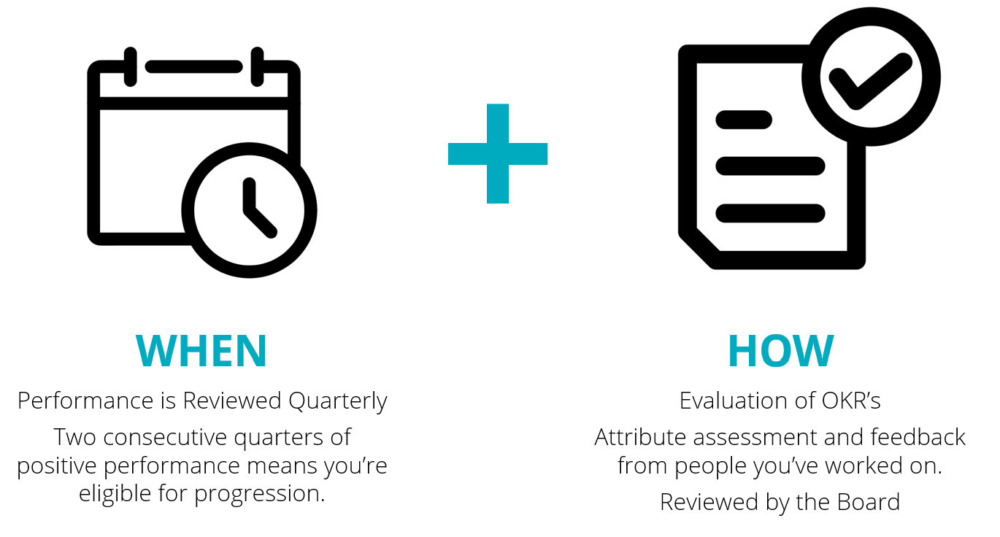

## Team Shapes & Supporting Roles

Having the right balance of ability to execute, client collaboration, leadership and deep technical expertise is key to the success of all our engagements.
The ideal arrangement is to have a cross-discipline team of consultants on each engagement. Each team is led in day-to-day activities by a Delivery Lead and a Technology Lead working together to get things done well.
A Client Partner oversees the long-term strategy and relationship with the client.

A Practice Lead provides support to use the right vendor technologies & Robiquity methodologies in the right way, Solution Architects provide big picture thinking and deep technical expertise for the most challenging problems, and everyone works together to deliver high quality outcomes.

While we may not always be able to deploy the ideal shape of team on every engagement due, to client preferences or our own limitations, we always aim to get as close to this shape as we can.

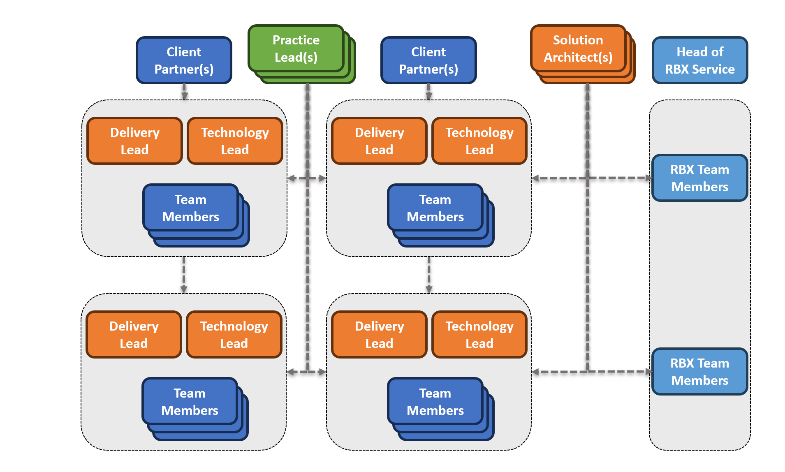

## Frequently Asked Questions

**If I don’t have an opportunity to do work that contributes to my OKR’s will I be penalised in my review?**

No. If the work that you are doing for Robiquity takes you away from tasks that would normally count toward your OKR’s, then that will not be held against you. (The example is that if someone is doing strategic, presales work that is not counted as billable utilisation, will that persons utilisation OKR be adjusted accordingly). 

 
**When will this new review model be rolled out? October or January?**

The rollout of the new review approach has yet to be confirmed.  Rest assured that the previous approach will be applied until the new model is rolled out and nobody’s efforts to date will be ‘reset’ as a result of the new approach. 

 

**What is the fastest that someone at associate could get to Manager level?**

If an individual has amazing performance, then they would need 2 quarters to move between each level. So, 2 quarters to get to Consultant, 2 quarters to get to Senior Consultant, 2 quarters to get to Principal Consultant and then 2 quarters to get to Manager. This would be a grand total of 2.5 years. 

 

**Will we get dedicated time to work on our certifications and professional development?**

We’re still working out the detail of how non-billed time might be used and what is a sensible level of non-billed time – so right now, the answer is ‘maybe’. 

 

**I love / hate the billing bonus, are there any plans to change how it works?** 

We appreciate that the billing bonus is loved and hated in equal measure. We also acknowledge that it drives some amazing behaviours, and some not so amazing behaviours. Because the billing bonus is part of our staff contract, we’re giving some very careful thought to what we do next, if anything. Any changes would need to be aligned to our financial year. 