# Recruitment

- [Recruitment Process Slides](https://sinewgroupltd-my.sharepoint.com/:p:/g/personal/ndunlop_robiquity_com/EV9g3RYGeC1HhwsjUfj15b0BFkXx3Tcf9rYbebRYlc3kIQ?e=0OMahR)

##  Overview - The End to End Process

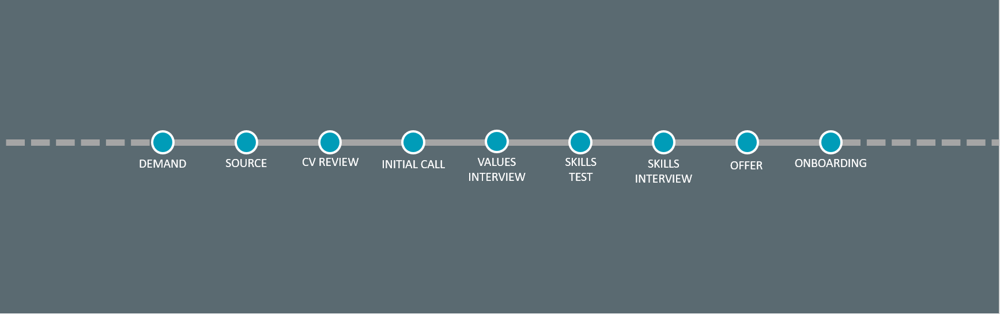  

## Tracking Candidates
We use a ** Microsoft Planner Board ** to track all our open roles and all our candidate details.  This includes their CV, all our interactions, all our feedback and our final decision. We aim to move things along quickly and give candidates a really great experience of engaging with Robiquity. If you're involved in the recruitment process, keep things timely and accurate so that we don't keep candidates waiting in a very competitive recruitment market.

## Demand
### When, What, How Many?
Demand is simply the statement of how many people we need to hire and what skills and experience were looking for in those people. Recruiters can only work so fast to fill demand and it takes time for recruitment campaigns to bear fruit, so we need to be clear and consistent in what we tell recruiters to go looking for, and we need to be patient and let them do their work. Weekly changes don’t work. Demand comes from two sources:

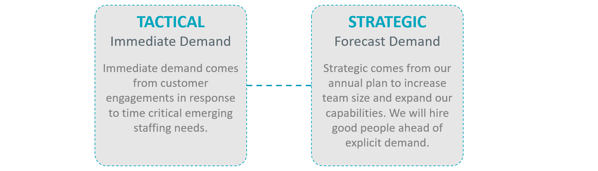   

## Sourcing
### How we find great people
We’ll generally take any candidates from any source, but we have three main routes to sourcing great people.  No matter where we source candidates, they all go through the same ‘firm but fair’ interview process. It’s also worth remembering that modern recruitment is as much about making sure the candidates like us as much as we like them!

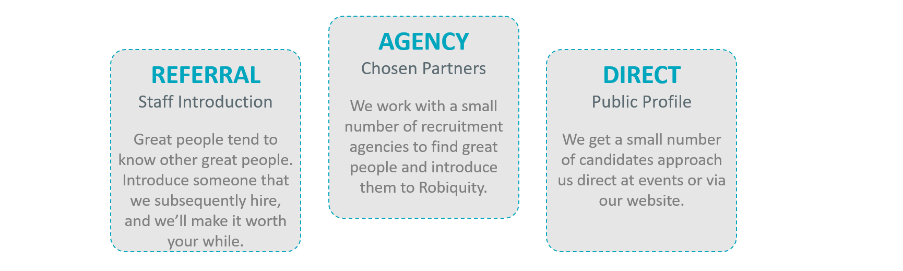   

** Tactical demand ** is usually urgent and is often presented by Delivery Leads, Technology Leads or Client Partners in response to a customer directly asking for more people.

** Strategic demand ** is a more long-term plan to get the right number of people with the right skills into the company to support our annual plan.
Strategic demand is defined by the board and doesn’t vary much over time. Strategic demand means we occasionally, carefully hire specific roles, even when there is no explicit, immediate demand - its all part of the plan.

We make use of recruitment agencies to find our potential hires, but this is an expensive process. We’ve created our internal recruitment team so we can do more of this ourselves.
We only work with a select number of agencies. They are tracked on our Preferred Supplier List (PSL). If an agency is not on our PSL, we don't work with them. This might seem odd at first, but we need to carefully control how we are represented in the job market, and having too many agencies, all claiming to represent us can cause problems if they all present the same candidate. Agencies on our PSL know how we like to be represented, the kind of candidates we're looking for and how our recruitment process works - and perhaps more importantly, they have all the right legal agreements in place with us.  

Another huge source of candidates is referrals & introductions from our existing team member. We often find that good people know other good people they have worked with before.
If you know some great from your network, please do refer them by giving their details and give them to internal recruitment, mentioning that they are a referral. All referrals will go through the standard process. Everyone including contractors can refer people to us. If your referral ends up joining us, we'll give you a nice bonus for the referral.

Overall recruitment demand is quantified by the COO, the TOD and the HR Director who work with a selected set of external agencies to make sure we go looking for the right people at the right time.

## CV Review
### The First Step
With so many varied roles on offer at Robiquity and so many different tools, techniques and technologies in use, it can be hard to assess how suitable a candidate is for a role at Robiquity. Despite all these variables, there are some common gotcha’s that should make you think more carefully about progressing a candidate. This isn’t an exhaustive list, and doesn’t mean candidates should automatically be discounted!

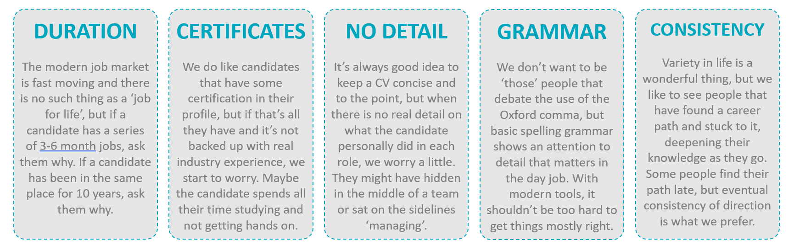   

## Initial Call
### Getting to know each other
The initial call is a great way of getting to know the candidate, understanding their motivations and get a feel for how they interact with other people. With increasing competition for skilled candidates, this is also a great time to sell the benefits of Robiquity to the candidate and get them excited about the opportunities that a role at Robiquity can offer.

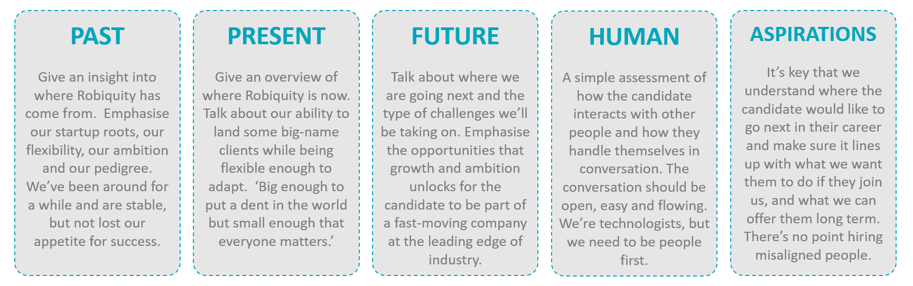   

## Candidate Review
### Sorting the good from the not so good
From the CV review, or a link to a LinkedIn profile if the world is moving particularly quickly, and the initial call you should get a good feel for the candidate. Regardless of the specific role we’re looking for, we have a couple of attributes that we like to see in all candidates:

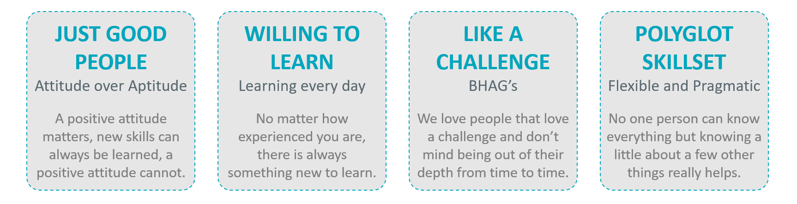   

## The Interviews
### Assessing Attributes and Skills

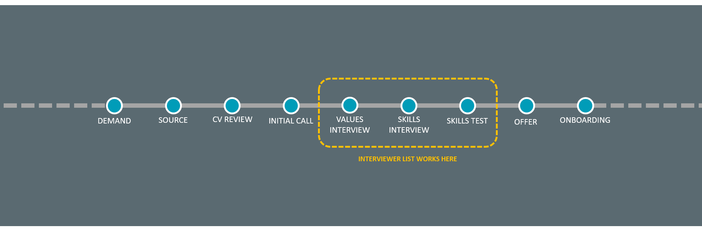   

### Building an Interviewer List
#### Why?
It’s important that involve a mix of people in the interview process to make sure we don’t just hire lots of people that are just like one interviewer. Having  lots of people who know how to successfully interview candidates also gives us the ability to ramp up recruitment if needed. 

#### Quality and Consistency?
As we involve more people in the interview process its important that we have a shared view of what a good candidate looks like and use a consistent approach to reach a decision. We cannot compromise on candidate quality and need to make sure we hire the best. – hence this content on our interview process and our set of consistent interview questions.   

#### Pair Up
Every interview should be performed by one experienced person from the interviewer list and one person who is learning how we interview. Staff that are learning to interview will play a supporting role in two interviews and then lead two interviews with an experienced member of staff supporting before they are signed off to lead interviews and train others. Each interview should be led by someone who is on the interviewer list.

## Interview Tips
#### Set the scene
Make sure the candidate knows the purpose of the interview, how long it will last and how its going to work. 
#### Sell the benefits of Robiquity
Give candidates a flavour of life at Robiquity with your behaviour, actions and stories. 
#### Set them at ease
Tell them about yourself, how you got to Robiquity, and the kind of things you do day to day.  Make it a conversation instead of an interrogation.
#### Ask the right questions
Make sure you ask a mix of behaviour-based and skills-based questions at the right level for the candidate to get a balanced view of their capabilities and potential. 
#### Let them talk
The interview is a two-way process. Let the candidate talk. Make it a structured conversation rather than a series of rapid-fire questions. Let the candidate ask their own questions of us.

## Values Interview
### Going a little deeper
We use the values interview to make sure that the candidate exhibits most of the Robiquity values and would bring something new and positive to the team. We don’t just want to hire ‘people just like us’, we want to hire people that have the same values but also bring  something new to our culture. By carefully evolving our culture and values by bringing new additive perspectives into the organisation.

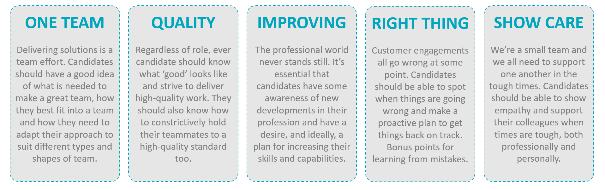   

### Values interview questions
#### Introductions 
* Walk through CV – explore roles and skills.  Probe the best and worst parts of each job and triggers for move. 

#### Value:  One team 
* Describe the type of team that you work best within?  Is there a specific methodology or communication style you think helps to bond a team?  
* What was the most successful team you were a member of and what was your role?   What contributed to that teams success? 

#### Value:  Quality 
* When working on a project or deliverable, what steps do you think are necessary to ensure the right outcomes are delivered to an acceptable standard? 
* Have you ever peer reviewed your colleagues work?  If so, have you ever experienced difficulty with this or had to provide constructive feedback? 
 
#### Value:  Keep Improving 
* What steps do you take to keep your skills fresh and up to date?  Are there any websites or podcasts you regularly review? 
* What do you want to learn about next?  

#### Value:  Do the right thing 
* Tell me about a time at work where things were perhaps going wrong with a project or within the team.   What did you do?  Reflecting back, would you do anything differently? 

#### Value:  Show we care 
* Have you ever had to support a client or colleague through a tough time?   
* Have you had responsibility outside of your core role such as CSR, social committee, employee advocacy?  

#### Additional/Optional Questions 
* How would your current or most recent manager describe you? 
* Describe yourself in 3 words? 
* If you didn’t have to work for a living, what would you do? 
* What are your general thoughts about the advancement of AI? 
* Where do you want your career to head in the longer-term? 
* What has been your biggest personal or professional accomplishment? 

LINK TO TEMPLATE

## Skills Interview
### Exploring the Mindset
Being  a great consultant is about lots more than just technology. We have a series of questions that explore the experience of candidates in a range of different situations that they’ll encounter when finding, designing and delivering solutions for our customer. They key to all these questions is finding out how the candidate thinks, how they solve problems and how they respond to challenges – rather than just how much tech they know.  

We have a different set of questions for each of our disciplines:

- [Developer Interview Questions](https://sinewgroupltd-my.sharepoint.com/:x:/g/personal/ndunlop_robiquity_com/EbKTEJ-bZVtAhagZC5DREd4BBxW3FAmhaWOPHLjA9t2KDg?e=uhIlXb)
- [Discovery Interview Questions](https://sinewgroupltd-my.sharepoint.com/:x:/g/personal/ndunlop_robiquity_com/EVDQjv9JZfhAikb6e07_8PoBF3e8Y4Rixkt1tBz0tr9SHQ?e=ddelZA)

## Skills Test
### Proving Hands On Capability
While conversation is a great way to understand how a candidate thinks, how they solve problems and how they react under pressure, the only sure-fire way to know if the can code, is to set them a test.  We have similar coding tests for all of our preferred development platforms. None of them are too onerous and all of them can be tackled in a number of ways that allow candidates to show their creativity.  We have tests for:

* Power Platform
* Blue Prism
* UI Path

## Assessment and Feedback
#### Be Clear and Thorough
Your feedback could have a big impact on someone’s career. Provide a clear and thorough write up and bear in mind that it may be shared with the candidate, so keep it professional.  
#### Suggest Resources
Whether we make an offer, we want candidates to have a positive impression of Robiquity. If possible, recommend books, blog posts, courses etc. that would be useful for the candidates, professional development. 
#### Strengths and Weaknesses
Clearly discuss the strengths and weaknesses of the candidate. Occasionally, we’ll hire a candidate when their weaknesses can be addressed quickly. Make it very clear where you see the candidate fitting into the Robiquity team.  
#### Highlight gaps
If there were any questions or areas of capability that you didn’t manage to explore, be sure to highlight them so they can be followed up later, if needed.

## Making a Recommendation
#### Reach a joint decision
Interviewing should be done by two people to make sure no important points are missed. You should reach a joint decision on every candidate, discussing any areas of disagreement. 
#### Clearly State your View
Your feedback could have a big impact on someone’s career. Provide a clear and thorough write up and bear in mind that it may be shared with the candidate, so keep it professional.  
#### Make Concerns Clear
Whether we make an offer, we want candidates to have a positive impression of Robiquity. If possible, recommend books, blog posts, courses etc. that would be useful for the candidates, professional development. 
#### Robiquity Recommendation
Base your recommendation on whether the candidate is a good fit for Robiquity as a whole, not just for one particular project.

## Making an Offer
#### You don’t need to!
The good news is that you don’t need to be involved in the offer process. Once you’ve provided your feedback and recommendations, the recruitment team will take an appropriate offer proposal to the board for approval. 

You may be contacted by either the recruitment team or the board if there are any queries or concerns about the candidates, or they just want a bit of additional insight.

Your recommendations will play a very large role in the offer we make to a candidate. We trust your judgement.

## The Essentials
### The Prime Directive
The number one rule is that we are looking for “Good People”.  Everyone at Robiquity has a passion to do a good job, pull their weight, contribute to the team and learn more.  

‘Good’ is very much defined by attitude rather than aptitude.  

We don’t mind hiring people who are keen but don’t have all the right skills.  If they are keen to learn and have a positive outlook, we want them onboard.  

Being ‘good’ doesn’t necessarily mean being good a software development, wrangling data or managing services.  Soft skills and consultancy skills are just as important.  

Note that candidates need to have a level of experience that is matched by their seniority.  Being really keen to learn software development after a lifetime in a non-technical role, and still expecting senior responsibilities and salary wont work.

   

### Unlocking Human Potential
Think about the types of skills and disciplines we need to bring into the business.

As you might imagine, we need to bring in people with skills and experience that match the kinds of things that we offer to our customers.

For those that don’t know we have five service propositions.

* Low Code Solutions
* Intelligent Automation
* Service and Process Design
* Data and Analytics
* Managed Services

We're looking for people with existing skill in one or more of those areas, or people that want to develop their skills in those areas.

### The Kind of Person we're looking for

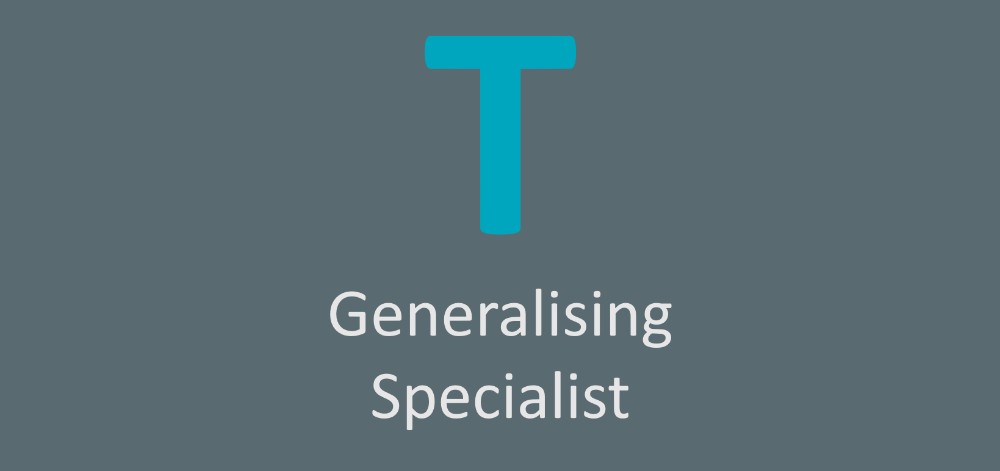   

### A Growing Mix of Skills

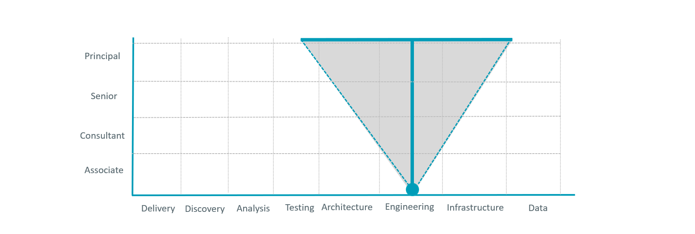   

Another way to think about the T-Shaped consultant is that the top of the T is the destination, but you’ll follow a “V” shaped journey to get there

We have some of our common roles/disciplines across the bottom of this chart - the order isn’t important.

We have our levels of consultancy experience up the side.

As you start your career, in this example as a budding full stack engineer, you’ll focus just on full stack engineering- you’ll learn a language in depth and learn how to put it to use.  As you progress to Consultant, you might learn another language 
and some alternative tech stacks.  You’ll start to learn a bit about architecture and system design, maybe a few other skills.  As you start to approach Senior you’ll start to learn a bit about test or requirements analysis or planning or infrastructure and cloud.  As you progress to Principal you’ll start to expand your knowledge into delivery approaches and data and maybe mobile and maybe a bit of design.

Throughout this process you’ll need people and consultancy skills.

The order of disciplines/skills isn’t important.  What is important is the continuous growth and learning.

We want people who want to go on that journey.  Some people have a wider triangle, others have a narrower triangle - but none of them are static. 

### Personality Types

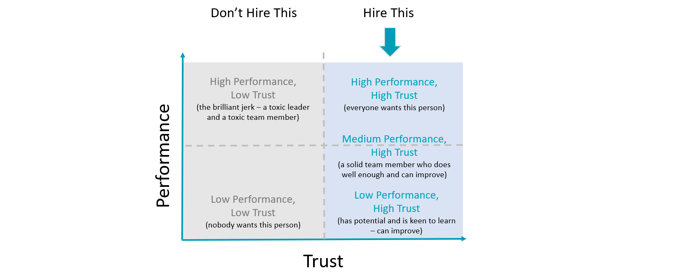   

To drill into the types of people we need a little more, consider this diagram. This is from a Simon Sinek talk (https://www.youtube.com/watch?v=YPDmNaEG8v4) The data behind the diagram comes from some leadership analysis he did with the US Navy Seals and they evaluate colleagues on these two axis. The vertical axis is performance on the battlefield. The horizontal axis is performance off the battlefield. Put another way, the vertical axis is “Do I trust you with my life?” and the horizontal axis is “Do I trust you with my money or my wife?” - if you don’t have a wife then insert your husband/partner/significant other/beloved pet! 

Nobody wants low performance and low trust - pretty obvious. Everybody wants high performance, high trust - superstars, again, pretty obvious High performance and low trust is a “Briliant Jerk” who is a toxic team member and a toxic leader - we don’t want them, they make things worse. We’d rather have Medium performance, high trust and Low Performance, high trust people - they can all play an important part in our company, they can all contribute valuable things and they can all improve their performance with a little help.

