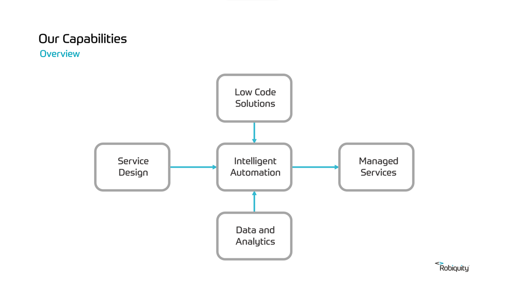

# Core Capabilities

- [Core Capabilities Slides](https://sinewgroupltd-my.sharepoint.com/:p:/g/personal/ndunlop_Nimble_com/Ef1IoJMnEilDry79Oji_Ny4BTkrNDM2bNSBeCccFxqmxkQ?e=1dGTlK)

## Introduction

Nimble started life as a Robotic Process Automation company. Over the years, in response to a changing market and increasing demand from our customers, we've expanded our capabilities. Our main objective is to deliver a set of composable capabilities that allow us to build and deliver solutions that put humans first.

## Composable Capabilties 

* **Service Design** - Service design enhances user experience and business efficiency by employing a holistic, co-creative approach to innovate and streamline services, ensuring they are user-centred, effective, and seamlessly integrated.

* **Intelligent Automation** - Intelligent automation streamlines complex processes, boosts efficiency, and enhances decision-making by integrating artificial intelligence into everyday business operations.

* **Low Code Solutions** - Low code solutions accelerate digital transformation by enabling rapid application development, reducing the need for extensive coding, and empowering non-technical users to build and adapt business applications with ease.

* **Data and Analytics** - Data and analytics capabilities unlock actionable insights, drive strategic decision-making, and foster a culture of informed decision making through the deep analysis of trends and performance metrics.

* **Managed Services** - Managed service capabilities provide businesses with operational reliability, strategic IT support, and continuous optimization, allowing them to focus on core functions while experts manage their technological infrastructure.

## Service Design
**Crafting exceptional experiences**

Service Design revolutionizes our approach to solution delivery, creating seamless experiences for your team and customers. We meticulously analyse every customer touchpoint, from start to finish, improving processes and overall user experiences. 

Our structured approach guarantees solutions that align with technical requirements, business goals, and user needs, delivering improved efficiency and increased satisfaction. 

We create solutions that are not just effective but also enjoyable and meaningful, boosting user satisfaction and engagement.

Our Service Design and Discovery offerings:

* Customer experience strategy
* Process Mapping & Optimisation
* Discovery, Inception & Elaboration
* Automation readiness assessment
* Solution innovation & ideation
* Market Research & Analysis
* User Journey Mapping
* Design Sprints

## Intelligent Automation
**Enhancing business performance**

Intelligent automation is a transformative technology that seamlessly integrates artificial intelligence, robotic process automation and human ingenuity to revolutionize business operations. It empowers organizations to automate repetitive, rule-based tasks across various departments, enhancing efficiency, accuracy, and scalability. 

With intelligent automation, businesses can reduce operational costs, minimize errors, and free up humans for more strategic, creative endeavours. 

By harnessing the power of intelligent automation, businesses can achieve operational excellence, drive innovation, and stay competitive in today's rapidly evolving digital landscape.

Our Intelligent Automation offerings:

* Desktop, cloud and human in the loop automation
* Automation strategy & assessment
* Process automation & integration
* Centre of excellence implementation
* Platform and vendor migration
* Intelligent document processing
* Virtual assistant development
* Team augmentation

## Low Code Solutions
**Simplifying development, accelerating innovation**

Low code solutions revolutionize application development by streamlining and democratizing the process, enabling businesses to engage their existing team, including users, business analysts, and subject matter experts, for rapid application creation, deployment, and iteration of applications, resulting in substantial reductions in development time and costs.

Enhance collaboration between technology and business specialists, fosters innovation, accelerates digital transformation, promoting agility and adaptation to changing market demands and customer needs.

Low code solutions offer a more efficient and flexible way to build applications, unleashing the potential for faster time-to-market and improved customer experiences.

Our Low Code offerings:

* Low code adoption strategy
* Accelerated solution delivery
* Application migration and modernisation
* System integration implementation
* Proof of concept development
* Low code vendor analysis
* Team enablement & Centre of Excellence 
* Hackathon planning, support and execution

## Data and Analytics
**Empowering insights, driving decisions**

Data and analytics are powerful tools that transform raw information into valuable business insights, enabling informed decision-making. 

By harnessing data, organizations gain a competitive edge, identifying trends, and predicting future outcomes. They enhance operational efficiency, optimize resource allocation, and personalise customer experiences. Through data-driven strategies, businesses can minimize risks and maximize opportunities, ultimately improving their bottom line. 

Data-driven decision-making supports innovation, fosters agility, and empowers organizations to quickly adapt to changing market dynamics. In an increasingly data-driven world, embracing analytics is essential for organizations aiming to thrive and succeed.

Our Data and Analytics offerings:

* Data strategy development
* Data engineering
* Data collection, cleansing, integration and assurance
* Data warehousing, analysis and visualisation
* Business intelligence & predictive analytics
* Data ethics, compliance and advisory services
* Data governance

## Managed Services
**Your success, our expertise**

Our managed service team can handle the daily operations of the solution, ensuring it is well-maintained and optimized. Using our expertise in system administration, automation, and process improvement, we guarantee the smooth operation of critical business systems.

A Service Level Agreement (SLA) sets out the expected performance and service standards, giving the advantage of a dedicated support team with guaranteed quality.

This approach reduces your team's operational burden, offering expert practices for cost control and allow you to focus on primary business objectives.

Our Managed Service offerings:

* 24/7 solution operation, monitoring and support
* Operations strategy development
* Incident response and resolution
* System modernisation and optimisation
* Scalability and continuity planning
* Continuous improvement and optimisation
* Change management
* Cost management

