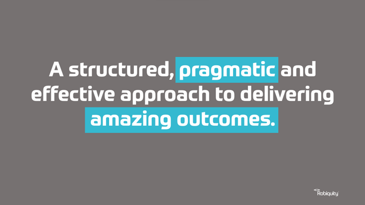
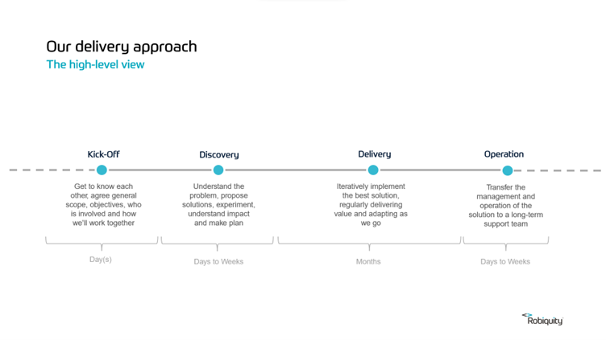
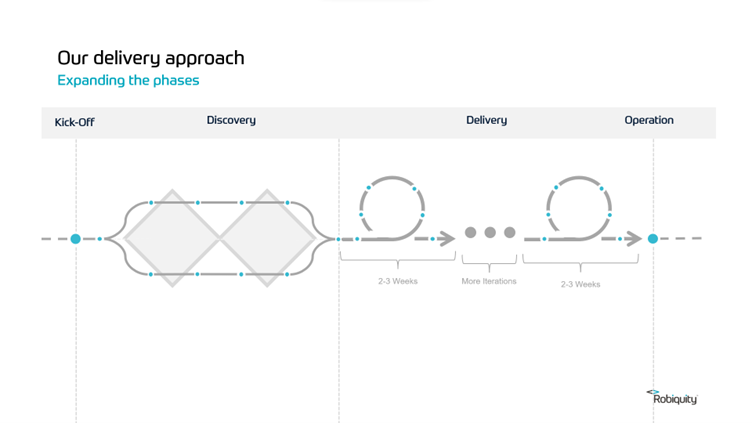
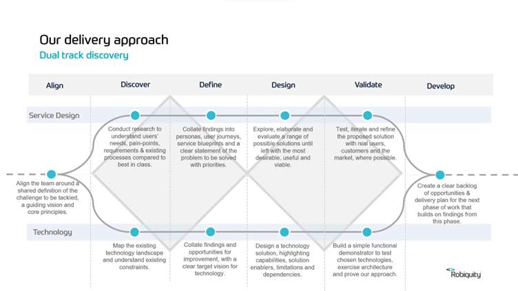
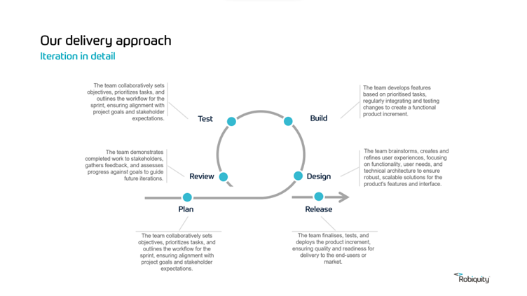

# Default Agile Delivery Process

- [Default Agile Delivery Process Slides](https://sinewgroupltd-my.sharepoint.com/:p:/g/personal/ndunlop_Nimble_com/EdPeynkmXPhMjSiVX1ll2N8BlkKCgz-v30GeOJ-_R8VsBQ?e=nMbSqa)

## Introduction

There is no 'one right way' to get things done. We always aim to stay flexible and deliver solutions in a way that works for our customers, but, when we are given a choice, we like to have a fairly consistent way of doing things. Our 'Default Agile Delivery Process' has been developed using hard fought experience from a range of engagements and will continue to evolve based on feedback from things we do in the future.  This is not an approach that needs to be slavishly followed. Think of it as a set of guiding principles with some suggestions for how things could be done well.

## Overview 
Regardless of what we're doing with a customer, or how we're doing it all, engagements follow the same outline of four basic phases. Some of the phases migh tbe very small, some may overlap a little and some may be skipped entirely, but the full lifecycle is as follows: 

## The Engagement Phases 
Regardless of what we're doing with a customer, or how we're doing it all, engagements follow the same outline of four basic phases. 

### Kick Off
The kick-off phase aims to clarify what we are doing and what we're not doing (scope), why we are doing it (vision/mission), what we aim to achieve (objectives), how we'll work together (ways of working), who will do what (stakeholders), the approach we'll take (ways of working) and some rough timelines (plan). We should also take a little time to get to know each other with ice-breakers and potentially a social activity - we could be working together for a long time.

The kick off shouldn't be exhaustive and it shouldn't take a huge amount of time. Depending on the size of the engagement, a kick off can take anything from a couple of hours to a day.

### Discovery
Discovery is used to gather insights, understand the customers challenges, identify the problems to be solved, explore solutions and possibly undertake some experiments to validate that solutions are viable and could deliver the desired value and imapact.  

The output from the discovery is usually a well validated solution (which may nor may not involve technology), a clear approach for getting things done, high level design and architecture views and a solution backlog / story map populated with themes and epics. Discovery may also include the development of prototype solutions to explore, confirm and demonstrate functionality.

### Delivery
Delivery is an iterative process of prioritising valuable solution features, building them, testing them, confirming user acceptance and releasing them to production environments.  In parallel, the backlog is refined, add greater detail on the work scheduled for the next iteration.

### Operation
Operation is a coordinated transfer of the day to management and support of the solution to a long-term support team. This may be a customers in-house team or Nimble Managed Services team. The duration and nature of the handover varies depending on the complexity of the solution and the capability of the support team.

## Discovery In Detail 

We use the Discovery Phase to gain a better understanding of the customers challenges and propose appropriate solutions.  We broadly follow the 'Double Diamond' discovery approach, but we've made a few tweaks to suit the kind of work we do.  It's worth noting that, as with everything at Nimble, we don't have to slavishly follow this process. 

The 'Double Diamond' approach has four main phases.  
- In the **'Align'** phase we get the team together to confirm the challenge we're aiming to tackle and establish the core principles of how we'll get things done.  This should be relatively lightweight if you've already done a 'Kick Off' session with key stakeholders, but its always worth having a quick alignment session before you start Discovery, especially if new people have been added to the team.
- In the **'Discover'** phase we aim to properly understand the client challenges and how their business operates now. A customer will often start an engagement by telling us what they want to achieve or a problem they want solving. It's our job to conduct research to fully understand the challenge, map how they do things now, and find any underlying root causes. In short, we want to make sure we have a full understanding before we start to devise solutions.
- In the **'Define'** phase we collate all the raw research data we've collected into a clear, accurate and understandable picture of the customers business, how it works now, the technology that powers it and any pain points that we've identified. In essence, this is how we play back our understanding to the customer and with their help, identify the right problems to solve.
- In the **'Design'** phase we begin to examine possible solutions to the problems we've identified.  We consider a large range of possible solutions and evaluate them for impact Vs difficulty of implementation. This gives us a good prioritisation for the solutions that we could implement.
- In the **'Validate'** phase we build simple demonstrators of the chosen solution and test them with customers, users and where appropriate, the wider market. These demonstrators may just be paper diagrams, clickable wireframes or working prototoypes with limited functionality. The idea is to gain insight into whether the solution works effectively and actually solves the problem. The output is a validated solution approach that we can say with good certainty will solve the customers challenges.
- In the **'Develop'** phase we build an initial release map for the product or service and a prioritised backlog of features that will make up the production system.

### The Service Design and Technology Split
Unlike the default 'Double Diamond' discovery approach, we've split the process into two main tracks, 'Service Design' and 'Technology'. This is simply because technology plays a much bigger role in the solutions we deliver to our customers. An easy way to think about these two tracks is that 'Service Design' is concerned with *What* we want the solution to do, and 'Technology' is concerned with *How* we want the solution to work. Some engagements required lots and lots of Service Design thinking and very little Technology, some engagements flip that around and we spend a long time talking Technology and not a lot talking Service Design. 

## Delivery In Detail 

The Delivery Phase is the main body of the engagement where we work to turn requirements into working solutions and products. A cross-functional team works in close collaboration with a customer to build the required solution, as defined as a series of User Stories that are held in a Product Backlog. Every two weeks, the team go through the same delivery cycle, planning, building, testing and releasing useful functionality. The repeated cycle allows the team and the customer to quickly learn from the work they are doing and change direction if needed.

- In the **'Plan'** phase the team get together in a 'Sprint Planning Workshop' to review, elaborate and size the work they aim to get done in the coming two weeks (agile iterations usually last 2-3 weeks, but it can vary depending on team preferences). The aim of the sprint planning workshop is to have a list of well elaborated and understood requirements (known as the Sprint Backlog) ready to be worked on. During planning the team review the stories to make sure everyone understands what the desired functionality is, roughly how the work might be done and what tests will be applied to confirm to the customer that the functionality works as desired. The team may also spend some time assigning a relative 'sizing' to the work so that everyone know which elements of the work are easy and which are tricky.  Note that estmates are usually done in abstract, relative measures such as 'Story Points' or 'T-Shirt' sizes rather than units of time.  The team are allowed to add or remove stories from the sprint backlog during sprint planning. Their commitment after Sprint Planning is that they will do their level best to deliver the sprint backlog by the end of the sprint.

- The team **'Design'**, **'Build'** and **'Test'** phases happen on a story by story basis throughout the sprint. They not usually discrete phases in the sprint. During a team standup, a team member (or two if they are working on stories in pairs), will pick up a story to work on. That team member will review the story and the associated acceptance criteria and then work to design and build just enough functionality to meet that requirement. They will usually also build some automated code level tests to confirm that what they have built is well engineered, often asking other team members to review their work. Some teams have a dedicated tester who will perform manual tests of the functionality developed in the story. Once a story has passed all its acceptance tests, it is marked as 'Done' and ready for demonstration to the customer at the end of the sprint. During development, the new functionality will often be repeatedly released to development and test environments to ensure that it works as part of the wider system, helping to exercise the 'path to live'.

- In the **'Review'** phase the team usually convene an 'End of Sprint Demo' to demonstrate the working functionality that they have completed as a result of working on the User Stories during the sprint.  In the End of Sprint Demo the customer will often get hands on with the system and run their own acceptance tests to confirm everything is working as expected.  Where the team have changed functionality or learned new things about the system being developed, they will discuss it with the customer.  The objective of the review is for the customer to be happy that the User Stories that have been implemented deliver the desired functionality. Once the cutomer is happy they formally 'Accept' this iteraton of the product and make a decision on whether they want to release it to a user facing environment.  Not every sprint will result in a public release of the system.

- In the **'Release'** phase the team does the work required to move the release candidate produced in the sprint to a production environment. The technical process to produce a release candidate is often highly automated, being performed every time a new feature is added to the solution.  The formal process for a production release may involve more steps that involve sign-off from the necessary stakeholders. There may also be an extended period of monitoring and support after a release has gone live.

## What about clients that don't use agile?

Not all organisations use an agile approach to get things done. Some organisations use a more traditional 'waterfall' approach to solution delivery. We tend to see this approach in organsiations that are more risk averse or those that have to work within the constraints of a lot of regulatory compliance. For example, organisations in the financial sector or the public sector sometimes favour a waterfall delivery approach. Don't worry, we have a delivery process for that too.  Check out the 'Nimble ATOM Framework' for more information.
