# The Discovery Workshop

- [Default Agile Delivery Process Slides](https://sinewgroupltd-my.sharepoint.com/:p:/g/personal/ndunlop_robiquity_com/EdPeynkmXPhMjSiVX1ll2N8BlkKCgz-v30GeOJ-_R8VsBQ?e=nMbSqa)

## Introduction

The ideal first step of any engagement is to build a really clear understanding of what challenge the customer is facing. Customers will often start by telling you a specific problem they are trying to solve or a thing they are trying to do, rather than explaining the business outcome they are trying to achieve.  In other words, they talk about the *how* or the *what* instead of the *why*.

The aim of the **Discovery** process is use a structured approach to:
1. **Understand** the outcome the customer is trying to achieve and its root causes.
2. **Identify** the common themes that should be investigated further.
3. **Explore** some possible solutions to tacle those themes.
4. **Rank** those solutions by impact and difficulty to identify which are really worth doing.
5. **Elaborate** on solutions to add detail and identify next steps.

After following these five steps, we should be able to: 
1. **Recommend** a course of action to our customer.
2. **Evaluate** the effort that will be involved in making it happen.
3. **Quantify** the postive impact it will have on their organisation.

## Approach
There are many, many different frameworks for doing the five key steps described above. Inside each of those frameworks, there are lots and lots of tools and techniques that can be used to get the engagement, insight, understanding and idea generation needed to deliver the three outcomes. It can be hard to know exactly what to do, and how to do it. 

The aim of this guide is to give you a *Nimble* way of doing *Discovery* that will deliver the outcomes we need. Like all the best ideas, this approach is a copy (with some tweaks) of someone else's idea. We like the Microsoft Envisioning Workshop approach and we blend it with other good ideas we find and develop as we do more and more discovery work.

## The Workshop

### 1. Understand
Our first step is to get a good understanding of the customers world, the problems they are facing, the things that are going well, and the things that *they* think could be improved. The first two might seem obvious, the last one is the crucial one that its really easy to forget to ask. The customer knows more about their organisation and the way it work than we ever will. **Always** ask them what *they* think the opportunities for improvement are!

#### A. Rose, Thorn, Bud
One of the most effective ways of get customers to tell us what is a challenge, what is going well and where the opportunities for improvement are, is to use the **Rose, Thorn and Bud** technique.

Rose, Thorn, Bud is a simple way of getting people talking and sharing what they know and what they think.  As a facilitator, you don't need to fully understand the points they raise. We’ll ask people to explain shortly.  This session can be really helpful to get everyone on the same page and make sure we’re all talking about the same kinds of things.

1. **What you'll need**  
   All you need to do this exercise is a bit of wall space, a stack of post it notes (ideally three different colours) and some pens.  If you're doing things remotely, then you'll need a shared board like Microsoft Whiteboard, Miro, Trello or something similar where multiple people can add information collaboratively.

2. **Setting up**  
   Setting up is really simple. Segment your shared board space into three columns.  At top of the first column put the title *Rose*. At the top of the second column put the title *Thorn*. At the top of the third column put *Bud*.

   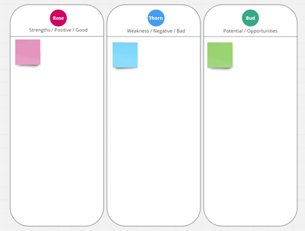   

3. **Running the Session**  
   You'll probably have a common theme for the session that you want to talk about. The focus can vary from very high level to being limted to one process. The exact scope is up to you and what you're trying to find out more about. Example might be:
   * "How do things work a Bloggs & Co?"
   * "Can you describe what happens in your department?"
   * "Describe how a customer interacts with your organisation"
   * "Tell me the good things, bad things and things that areas for improvement that have happened in the last six months"
  
  You simply ask participants to write one concept, statement, idea, *thing* on each post it note and add it to the appropriate column.   

  When you're running the session, there is no such thing as a bad idea or a bad suggestion. The objective is to generate LOTS of insights into what is going well, what isn’t going well and what attendees think could be improved. The more notes your participants generate, the better!  
  
4. **Knowing when to Stop**  
   As you run the session, resist the temptation to ask questions that would provoke lenghty, detailed discussion right now. Also resist the urge to discuss possible solutions. Try to keep the participants in 'observation generation' mode too.  There will eventually be a natural lull in the rate at which observations are generated. Once you think you've got all the useful observations from all participants, politely call and end to the session and get ready to move on to the next sesssion of the workshop.  

**Note:** Rose, Thorn, Bud is great to get a reasonable understanding of the customers world when you are limted for time. For real in-depth understanding we need to use techniques like interviews, 'day in the life' and 'customer personas'. These approaches take a lot more time, but yeild much more detailed information.

### 2. Identify  
Once we’ve got a big list of strengths (Roses), problems (Thorns) and opportunities (Buds), we can have a deeper discussion to understand them better, group related things together and identify some common themes.  In Rose, Thorn, Bud session partipants tend to share the very low-level details. It takes some effort to group things togethe, find common themes and identify the underlying elements. Ultimately, in this stage, we're trying to distil all that we've learned and identify the key things that we should investigate further.

#### A. Affinity Clustering  
Affinity Clustering is simply a fancy way of saying 'putting similar things together', and its really easy to do. This technique helps you to make sense of large collections of ideas, problems, opportunities, and well, anything really by identifying common themes in those large collections.  Once you've identified common themes you'll have a great list of important elements that you can investigate further.

1. **What you'll need**  
   All you need to do this exercise is another bit of wall space or a whiteboard, a couple of post it notes and some markers / whiteboard pens.  If you're doing things remotely, then you'll need a shared board like Microsoft Whiteboard, Miro, Trello or something similar where multiple people can add and edit information collaboratively.  The *most* important thing you'll need is a bit set of things that need sorting and grouping - something like the output of a **Rose, Thorn, Bud Session** would be ideal!

2. **Setting up**  
   Setting up is ultra simple. All you need to start with is your big list of unsorted items and some space to move them around and group them.

3. **Running the Session**  
   Running this session is extremely simple:  
   1. As the facilitator you can grab any post-it and read it out loud. There is probably an underlying theme to the text on the post-it. Move that post-it to a bit of blank space and put a large circle around it (With enough space to add more post-its to the circle). 
   2. Label the circle with a name that reflects the underlying theme. 
   3. You repeat this process, taking each post-it in turn and either putting them into an existing theme circle or making a new theme circle.
   4. If you're not sure of the theme behind any post-it you can ask the participants to explain what they mean. 
   5. If you're confident and have good alignment in the group, you can ask participants to move things into theme circles for you and everyone works to group the post-it notes.

    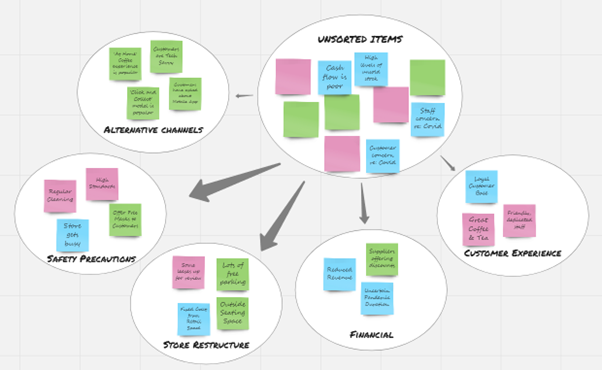   

    The discussion and debate about what each post-it means and what the underlying themes are is **very** valuable and these debates, discussion and explanations can be amazing for getting everyone on the same page and uncovering previously unseen details. Don't stifle the debate in this session!
  
4. **Knowing when to Stop**  
    When everything is grouped into themes, you're done!

#### B. "How Might We..." Statements
Once we've completed the Affinity Clustering exercise we'll have a useful list of underlying themes with a brilliant level of detail in the individual post-its. However, the challenge is that the themes, as they currently stand, aren't really anything we can action. We need to reshape and rephrase them into something that sets us a challenge and focusses our thinking.  "How might we...." statements (also known as 'Statement Starters'), do exactly that.

1. **What you'll need**  
   Again, all you need to do this exercise is a whiteboard and a whiteboard pen, or a shared board like Microsoft Whiteboard, Miro, Trello or something similar, if you're doing things remotely.  The *most* important thing you'll need is a set of themes relating to the subject of your discovery - something like the output of an **Affinity Matrix** would be ideal!

2. **Setting up**  
   To get setup, all you need is your list of themes and a big statement that says **"How might we ______________________"**

      

3. **Running the Session**  
On the face of it, running this session is really simple.  You need to distill all the information you've gathered so far in the themes into a couple of snappy "How might we ....." statements that encapsulate the situation(s) you're trying to improve. However, getting all the participants to agree what this is, and how best to express is sussinctly can be very challenging.  

   There are a couple of handy tips to bear in mind:  

   1. **Focus on the problems, opportunities or insights you've uncovered**   
    Some teams generate HMWs that are not specific to what they’ve learned. For example, How might we improve the user experience of the product? is not specific to what you might have uncovered in your discovery research. This question can result in ideas that don’t address the root problems and the insights you uncovered.

    **Problem:** Users aren't aware of our full product offerings.  
    **How Might We...** How might we increase awareness of the full product offerings?

   2. **Avoid suggesting a solution**  
      It can be easy to limit your thinking and embed solutions in your "How Might We" questions. Doing this restricts the pool of possibilities, and fewer ideas are generated. In the example below, the first HMW suggests a particular type of solution, whereas the second is agnostic about any particular solution.

    **Insight:** Users are often unsure about which form to complete when they file their taxes.  
    **How Might We... (poor):** "How might we tell users which form to complete to file their taxes?"   
    **How Might We... (good):**	"How might we make users feel confident they are filing their taxes correctly?"  

    3. **Keep your HMW's broad**  
    When writing HMW questions, ask yourself if you could rewrite them in a broader way? The broader the HMW, the more ideas can be generated.  

    **Insight:**	Users often spend a long time checking their submission for mistakes.  
    **How Might We... (good):**	How might we make it quick and easy for users to check their work for mistakes?  
    **How Might We... (better):**	How might we support users to efficiently draft submissions that they’re happy with?  

    4. **Focus on the desired outcome**  
    To avoid solving symptoms of the problems rather than the root problems themselves, ask yourself whether your HMW question focuses on the desired outcome.  

    **Problem:** 	Users often call us because they’re unsure about the application process.  
    **How Might We... (poor):**	How might we stop users from calling us?  
    **How Might We... (good):** How might we make users feel confident they have all the information they need?  

    5. **Phrase your HMW positively**  
    Stating your HMW questions positively can generate more ideas and also encourage creativity. If you find yourself using negative verbs like ‘reduce,’ ‘remove,’ ‘prevent,’ ask yourself if you can frame things more positively by using positive action verbs, like ‘increase,’ ‘create,’ ‘enhance,’ ‘promote’ and so on.  

    **Problem:** 	Users find the return process difficult.  
    **How Might We... (poor):**	How might we make the return process less difficult?  
    **How Might We... (good):** How might we make users feel confident they have all the information they need?  

    (See https://www.nngroup.com/articles/how-might-we-questions/ and https://www.luma-institute.com/statement-starters/ for more information)

4. **Knowing when to Stop**

    There is no limit to the number of "How Might We..." statements you can produce. The more you have, the more ideas you'll generate in subseqent session. If you feel you have to many, check for overlaps and see if you can combine them into broader "How Might We..." statements. Even if you have a lot of "How Might We..." statements, we'll be elaborating and prioritising them in the following sessions, so don't worry too much.

### 3. Explore
Once we've identified the challenge that we need to address, we can start to think about the people and functions affected by that challenge, and how we might shape an appropriate solution.  Challenges often span multiple parts of an organisation, multiple teams, multiple systems and multiple processes. Hopefully by performing the 'Rose, Thorn, Bud', 'Affinity Clustering' and 'How Might We' exercises you've seen that challenges are usually way bigger that the clients initial, probably single task focussed problem statement.

#### A. Creativity Matrix
One of the best ways to explore the functions, processes, systems and people that are affected by the challenge identified in our 'How Might We' statements, and come up with creative ideas to improve things, is to use a **Creativity Matrix**.

1. **What you'll need**  
   You'll need some of wall space, a stack of post it notes and some pens.  If you're doing things remotely, then you'll need a shared board like Microsoft Whiteboard, Miro, Trello or something similar where multiple people can add information collaboratively.

2. **Setting up**  
   Setting up is really simple. We start by building a table like structure made up of rows and columns.  In the top left corner, place one of your "How Might We" statements. Below that, in the first column of the table, write up to four categories for enabling solutions (e.g., technologies, environments, or policies) or the steps on the customers journey.  In the first row of the table, write up to four categories for things related to people (e.g., personas, market segments, types of stakeholder or problem statements).

    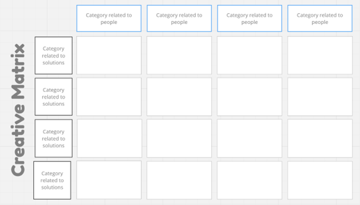   

3. **Running the Session**  
    Give participants a stack of sticky notes and pens and ask them to generate lots of ideas at the intersections of the rows and the columns, that relate to our "How might we..." statement. For example, if we had a step in the customer journey for "Ordering Coffee" and a people column of 'Customer', the intersection of those two elements could be phrased as "What are our ideas for helping customers order coffee in a Covid-19 safe way?"

    Encourage participants to fill every cell of the grid and generate as many ideas as possible. Quantity is our objecitive here, not quality. It might also help to get participants to draw and icon or sketch that represents their idea.

    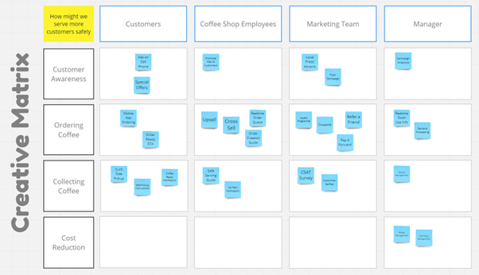   
   
4. **Knowing when to Stop**  
    Participants might naturally run out of ideas, but try and keep at it for at least 25 minutes. You might need to join in the idea generation process to keep things moving along and inspire other participants with some industry insight or off the wall thinking.
   
#### B. Affinity Clustering
Now that we have a whole host of ideas for potential solutions to our challenge, and those solutions consider all the steps for our process, and all the people involved, we need to do some clustering to pick out the common themes in our solutions.  This is a simple re-run of the Affinity Clustering exercise we went through earlier, except this time, we use the output of the Creativity Matrix as our source.

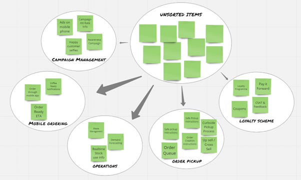   

   

### 4. Rank / Prioritise
Once we have our list of potential solutions we want rank them by importance and difficulty of implementation.  We’re looking for solutions that have high impact/value and are relatively easy to implement. We might also consider solutions that have high impact and value but are slightly harder to implement.

#### A. Difficulty and Impact Matrix
A really simple way of getting participants to identify which solutions should be implemented first is to use a **Difficulty Vs Impact** matrix.

1. **What you'll need**  
   You'll need some of wall space and a set of solutions that need to be ranked.  If you're doing things remotely, then you'll need a shared board like Microsoft Whiteboard, Miro, Trello or something similar where multiple people can add information collaboratively.  The output of Creativity Matrix grouped by Affinity Clustering provides exactly what we need.

2. **Setting up**  
   To get setup, all you need to do is create a really simple chart.  The vertical axis is used to represent impact. value or importance. The horizontal axis is used to represent difficulty.

    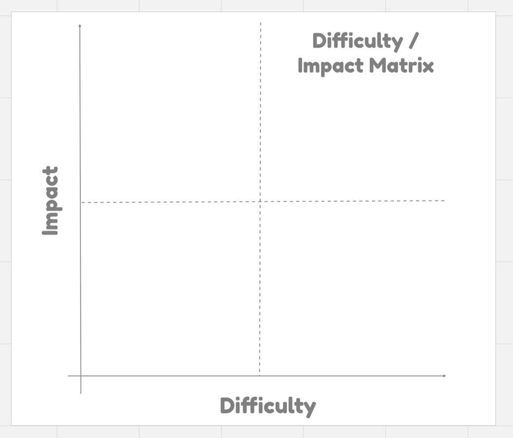   

3. **Running the Session**  
    Take a post-it note for each item you want to rank and ask participants to agree how important each one is.  Place the items alongside the vertical axis on the agreed upon order. No items can occupy the same space. Force participants to rank items clearly.  
    
    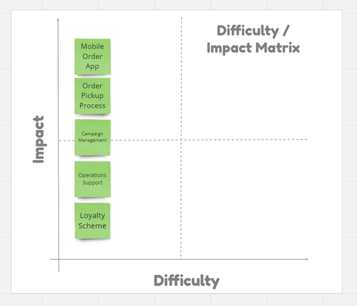   

    Next, ask participants to move each item right based on hard it would be to implement that item. Again, no items can occupy the same space.

    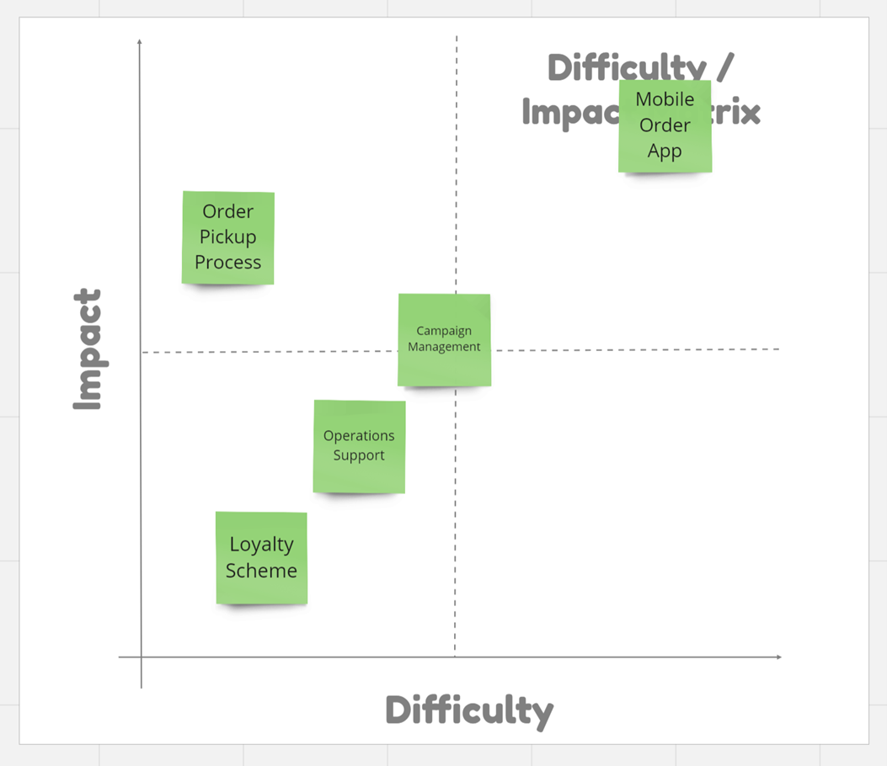   
    
4. **Knowing when to Stop**  
    When all the items have been placed on the grid and everyone agrees, then you're done.  The easy way to interpret the chart is to say that all the high value, low difficulty things in the top left quadrant, should be done as soon as you can. They are your quick wins.  The things in the top right quadrant are high value but more difficult to do. These should be considered as strategic iniatives. They will take time, but they will deliver value in the long run. The items in the bottom right quadrand are low value and difficult. You should probably avoid doing anything with them. The items in the bottom left quadrant are low value but easy to do. Consider carefully whether its worth doing those.

    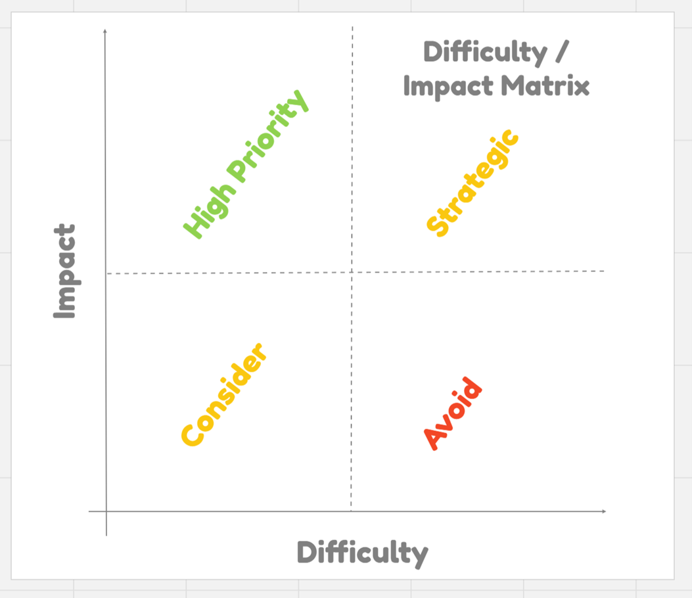   

### 5. Elaborate  
Once we have chosen a couple of solutions that we think are worth developing further, we need some techniques that help us to think about those solutions in some detail.  There are lots of ways of elaborating an idea and which one you pick will depend on how much time you have to do your elaboration. If you're looking to test out some ideas in a couple of hours or half a day, then story boards are a great way to go. If you have more time then a product inception can be a great way to spend around five days.

#### A. Storyboard and Concept Testing
Storyboarding is a great way to develop an idea and test the concept out before you actually build anything. It forces you to answer some of the most basic questions about your potential solution, which will save you a lot of wasted effort in the long run.

1. **What you'll need**  
   To get going with this session you'll need a Storyboard Template and all of the insights you've gained throughout this workshop. You'll probably need some post-it notes and some pens - or a suitable digital alternative.

2. **Setting up**  
   There isn't much setup. Just stick the template on the wall, the bigger the better and get your thinking hats on.  

    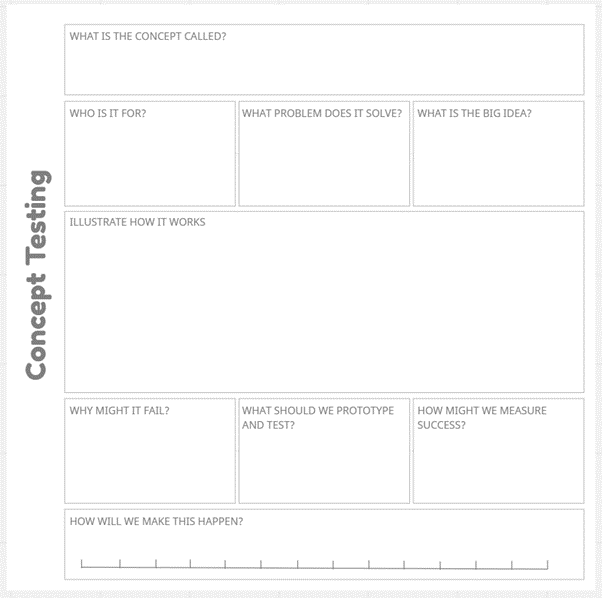   

3. **Running the Session**  
    During the session, ask the participants to fill in every box of the storyboard template with the details of one of your prioritised solutions. Challenge them to get creative and offer up as much detail as they can. There will probably be a lot of conversation, a lot of debate and a lot of "What did you mean when you said..."
    
    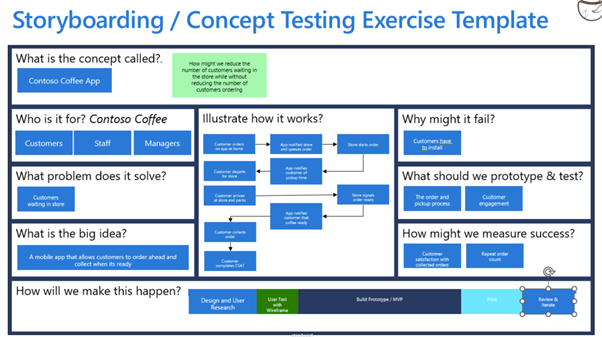   
    
4. **Knowing when to Stop**  
    When all the boxes on the storyboard template are full and you've got broad agreement that you know what your solutions is for, how it might work, what success looks like, why it might go wrong and how you might deliver it, you're done! You can repeat this storyboard session for each one of your prioritised solutions.

## Conclusion
Hopefully this workshop outline has given you an idea of how you might go from "We want to do a thing" to "We know what is worth doing" in collaboration with a customer. Each step is pretty simple, but when they are combined they provide some pretty compelling ways to understand the customers' needs and create some potential solutions. The whole process gets the customer engaged and thinking about the art of the possible without being too prescriptive about the approach taken and the technologies used.  

## Additional Resources
Remember, there are lots of different ways of doing this. This is just an approached that has worked for us in the past. If you want some more inspiration for different techniques you can add to your service design toolbox, check out:

* [Luma Toolbox](https://www.luma-institute.com/about-luma/luma-system-explore-methods/)

