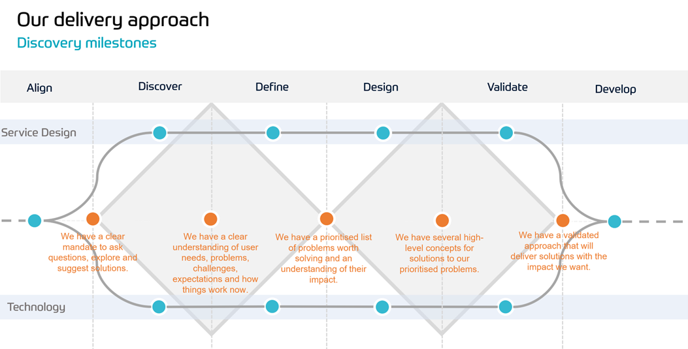

# Frequently Asked Questions

### Is Discovery typically delivered against an area of the business (a function e.g. Finance), an End to End Process (e.g. Procure to Pay) or against each opportunity (e.g. Email monitoring)?  
It could be any of the above, but ideally it would be against cross-functional, end to end processes which would ideally present multiple opportunities as an output.  

### Does Discovery give us a business case or clear idea of costs / complexity / timescales and Return on Investment?  
Discovery can be used in several ways, depending on where you focus your efforts and how long you take over the discovery process:  
   * To help the customer build a concensus of opinion and get stakeholders aligned on an initiative.
   * To help the customer clarify their current situation and make a map of challenges.
   * To help the customer understand the art of the possible and explore potential solutions to their problems.
   * All of the above.

In a full, end-to-end discovery, the 'Design' and 'Validate' phases are extended to give the team time to actually design and build some low fidelity prototypes of the desired solution. In these longer Discovery engagements, the team should arrive at a good understanding of the challenge to be address, the outcomes to be achieved and the solution to be implemented, having already established that it will deliver the desired outcomes. With this slightly more detailed work done, they should be able to provide 'Rough Order of Magnitude' estimates for the effort required, the time needed, they key deliverables and the key phases of any ongong work. This also means they they should be able to provide indicative costs, and potential some 'Return on Investment' numbers.
 
### Are there milestones where the triangles converge in the middle - between Define and Design? What is reviewed at this point?  
There are several milestones in the Discovery process:  
   * At the start of the first diamond, after any alignment session we should have a clear scope for our discovery and a mandate to ask questions, explore and suggest solutions.
   * In the middle of the first diamond, after we've finished the 'Discover' phase, we should have a clear understanding of the users needs, their problems, challenges and expectations and solid understanding of how things work now.
   * Between the two diamonds, after the 'Define' phase, We will have a prioritised list of problem that are worth solving and an understanding of their impact on the customers business.
   * In the middle of the second diamond, after the 'Design' phase, we'll have several high level concepts for solutions to our prioritised problems.
   * At the end of the second diamond, after the 'Validate' phase, we'll have a well validated approach that will deliver a solution with the business impact we want.  This is where we have reached a detailed understanding of the problem and benefits potential, plus vision for the solution, at which point we’re asking permission to continue to refine into detailed design.

   

### How long does Discovery take typically? And what does it cost?  
The duration of a Discovery engagement depends on scope. A *very* quick version can be done in a couple of days, but we should be aiming for an initial 2-3 weeks to complete the 'Discover/Define' diamond, then a further 2-3 weeks for the 'Design/Validate' diamond. A discovery is typically two people.  One from a Service Design/Analysis background and one from a Technical background.
