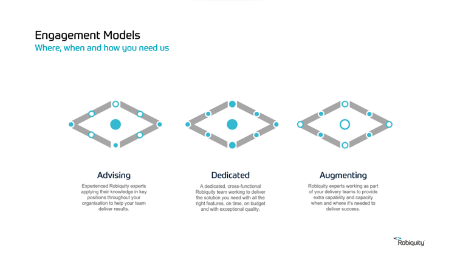
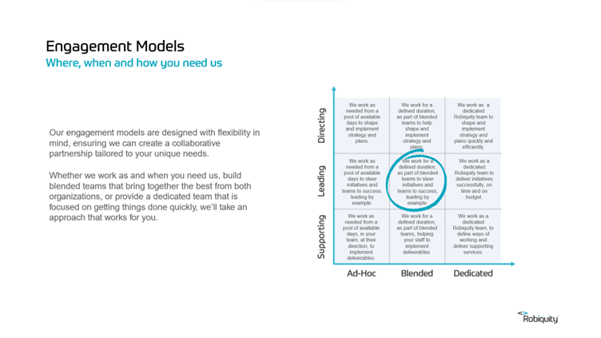

# Engagement Models

- [Engagement Model Slides](https://sinewgroupltd-my.sharepoint.com/:p:/g/personal/ndunlop_Nimble_com/EcfF_gf5hqZDuEeXLc_tWTsBCH0jlIxeBuzmADL3P5kwHA?e=XdrLQH)

## Introduction

We’ll work on any engagement, in pretty much any way. However, there are some commercial and cultural reasons behind why we have preferences:

* Ideally, Nimble staff would either be in a leading position, or in a team led by a Nimble person, working to accomplish a defined outcome.

* We also prefer longer, contiguous engagements where staff have well-defined, full-time roles.

* Engagements where our staff are providing augmentation in a customer led team on an ill-defined engagement, with no clear outcome, and no clear route to making things better should avoided. They are rarely the best way to deliver value to our customers and satisfying engagements to our staff.

## The Details 

