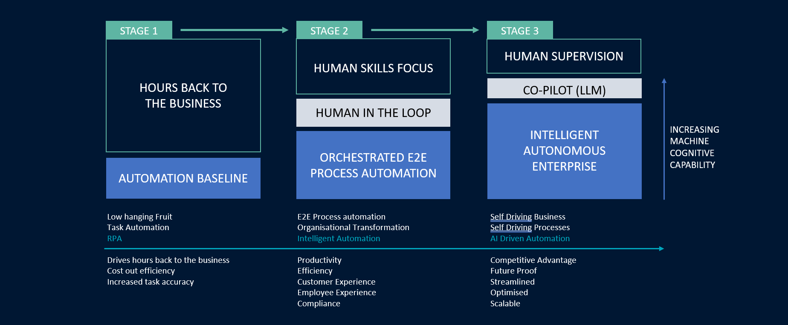

# The Journey to a Self-Driving Business

- [Introduction to Intelligent Automation Slides](https://sinewgroupltd-my.sharepoint.com/:p:/g/personal/ndunlop_robiquity_com/EQFZnZ7VwO5HofCfA43EABMBMvUxUgOzHDxcBF-KDGrE5A?e=DN250Q)

** Three stages to digital success **

The journey from Robotic Process Automation (RPA) to self-driving businesses is an evolution marked by three distinct stages, each building upon the capabilities of the previous one.

### Stage One: Robotic Process Automation (RPA)
In the initial stage, organizations adopt RPA to automate repetitive, rule-based tasks within their processes. RPA bots mimic human actions, interacting with software applications and systems to execute tasks efficiently. This phase offers quick wins in terms of efficiency gains and cost reduction, but it is limited to relatively simple, structured processes.

### Stage Two: Back-End RPA, Intelligent Automation & Human-in-the-Loop Systems 
Phase two expands the automation journey by incorporating more advanced technologies.

** Back-End RPA: ** Organizations extend their automation efforts to include more complex processes, such as data manipulation and integration between multiple systems. Back-end RPA leverages automation to streamline data flow and enhance backend operations.

** Intelligent Automation: ** This phase introduces machine learning and AI-driven technologies, enabling systems to make decisions based on data  and patterns. It empowers businesses to handle unstructured data, make predictions, and optimize processes. Intelligent automation goes beyond rule-based tasks, adding cognitive capabilities to RPA.

** Human-in-the-Loop Systems: ** Acknowledging the importance of human expertise, organizations include humans in the automation loop. These systems leverage human judgment and intervention, when necessary, combining the strengths of both automation and human intelligence.

### Stage Three: Self-Driving Businesses 
The ultimate phase represents the vision of self-driving businesses. In this stage, organizations achieve a high level of autonomy and intelligence in their operations:

** Full Autonomy: ** Self-driving businesses are characterized by processes that can operate independently without human intervention. Automation, AI, and machine learning continuously monitor, optimize, and adapt    processes to changing conditions.

** Predictive and Adaptive: ** These businesses anticipate future trends, customer behavior, and market changes, adapting their strategies in real-time. They use predictive analytics and AI to make informed decisions and optimize operations.

** Strategic Focus: ** With routine tasks fully automated, human resources are freed to focus on high-value tasks, innovation, and strategic initiatives. The business's core purpose becomes the primary focus.

** Continuous Improvement: ** Self-driving businesses are built on a foundation of continuous improvement. They use data-driven insights and feedback loops to refine processes, ensuring ongoing efficiency and effectiveness.

** Resilience and Scalability: ** Self-driving businesses are agile and capable of scaling rapidly. They can respond to disruptions, market shifts, and growth opportunities with ease.

The journey from RPA to self-driving businesses represents a transformation in how organizations operate. It is a progression from basic automation to advanced intelligence, ultimately leading to businesses that are more efficient, agile, and aligned with their core purpose.

# The Journey from Robotic Process Automation to Artificial Intelligence
** The evolution of automation unlocks huge business benefits **

   

# Stage 1 - Robotic Process Automation
** Using digital workers for repetitive tasks **

   

Robotic Process Automation (RPA) is like a digital worker for your computer. Think of tasks you do repeatedly, such as transferring data between applications or generating invoices. Instead of you doing them over and over, RPA can automate them. It uses software "robots" to mimic human actions, navigating programs and systems just as you would. Unlike bespoke software, which requires in-depth coding and system changes, RPA operates on the surface, interacting with applications at the user interface level. So, it's more like teaching software to handle tasks by showing it what to do, step-by-step. 

By using RPA, businesses save time, reduce errors, and free up their staff for more valuable, nuanced, human-centric tasks. In short, RPA is about streamlining repetitive processes with the help of virtual bots, making work smoother and more efficient.

#### Benefits include:
* ** Cost Savings: ** By automating repetitive tasks, businesses can reduce the costs associated with manual labour.
* ** Productivity Boost: ** Employees are freed from mundane tasks, allowing them to focus on more value-added activities and strategic roles.
* ** Efficiency: ** RPA bots can operate 24/7 without breaks, ensuring tasks are completed faster and without delays.
* ** Accuracy: ** RPA reduces the risk of human errors that can occur in manual data entry or repetitive tasks.
* ** Scalability: ** Businesses can easily scale up or down their RPA operations based on needs, without significant changes to infrastructure.

# Stage 2 - End to End Process Automation
** Seamless integreation of digital systems **

   

Back-end RPA, also known as "Unattended RPA," is like having a silent digital worker operating behind the scenes. These digital robots perform tasks autonomously without human interaction, usually on servers rather than personal computers. Imagine routine tasks, like data updates or report generations, happening automatically at scheduled times or when specific conditions are met. Instead of staff manually initiating these processes, back-end RPA robots take over, working 24/7 without breaks. They can be triggered by events, like receiving a new order, or run at set times, like nightly data backups. 

By using unattended RPA, tasks are completed faster, errors are minimized, and human workers can focus on more strategic activities. Back-end RPA operates largely independently of humans, streamlining operations out of sight and ensuring everything runs smoothly. 

#### Benefits include:
* ** 24/7 Operation: ** These robots can work continuously without breaks, ensuring tasks are completed day and night.
* ** Unlocked Human Potential: ** By automating repetitive tasks, human resources can be redirected to more strategic and value-added roles.
* ** Event-Driven Processing: ** Bots can be triggered by specific events, enabling real-time processing when certain conditions are met.
* ** Integration with Legacy Systems: ** Can work seamlessly with existing IT solutions without the need for extensive overhauls.
* ** Centralized Monitoring: ** Enables centralized control, orchestration and oversight, allowing businesses to monitor and optimize processes.

# Stage 2 - Intelligent Automation
** Thinking, learning, digital systems **

   

Intelligent Automation (IA) is like giving a brain to your digital workforce. While traditional automation can handle repetitive tasks based on set rules, IA goes a step further by integrating artificial intelligence (AI) capabilities. This means it can not only follow instructions but also learn, adapt, and make decisions. Imagine a software tool that not only processes data but understands it, recognizes patterns, and even predicts future trends. IA combines the best of robotic process automation (RPA) with machine learning, natural language processing, and other AI technologies. So, instead of just automating manual tasks, it brings smart decision-making into the mix. Businesses use IA to enhance customer interactions, process complex data, and even generate insights. 

With IA, automation becomes more dynamic, adaptable, and intelligent, allowing for more advanced operations and richer outcomes. 

#### Benefits include:
* ** Cognitive Insights: ** With machine learning and data analytics, IA provides valuable insights, aiding in better decision-making.
* ** Adaptability: ** IA systems can learn and adapt from previous experiences, ensuring continuous improvement in process execution.
* ** Better Customer Experience: ** IA can personalize interactions based on customer data and preferences, leading to more tailored experiences.
* ** Process Optimization: ** IA can identify inefficiencies and suggest areas for improvement.
* ** Handling of Unstructured Data: ** IA can process and extract information from unstructured sources, like emails, invoices and speech adding depth to data analysis.

# Stage 2 - Human in the Loop
** Automation and human expertise combined **

   

Human in the Loop (HITL) marries automation with human expertise. Imagine a smart assembly line: machines handle the bulk of the work, but when a tricky situation arises, it's flagged for human attention. In HITL setups, most processes are automated, yet they defer to humans for ambiguous or complex scenarios. Consider a document scanning tool: while it might auto-categorize most documents, unusual ones might be highlighted for a human to classify. This dual approach offers two benefits: First, it ensures that nuanced challenges get the discernment of human judgment. Second, each human intervention not only solves the immediate issue but also trains the system, enhancing its future accuracy and efficiency. In essence, HITL leverages the strengths of both machines and humans, ensuring tasks are executed with the optimal blend of speed, precision, and insight.

#### Benefits include:
* ** Improved Accuracy: ** Humans can intervene in complex or ambiguous situations where automation might falter.
* ** Continuous Learning: ** Each human intervention provides feedback to the system, enabling it to learn and improve its future performance.
* ** Nuanced Decision-Making: ** Humans bring context, emotion, and ethics into decision-making, addressing scenarios that automation may oversimplify.
* ** Flexibility: ** As processes evolve or unexpected situations arise, humans can adapt in real-time, ensuring ongoing operations.
* ** Trust and Transparency: ** Having humans in the loop can boost trust in automated systems, as stakeholders know there's human oversight ensuring ethical and accurate outcomes.

# Stage 3 - The Self Driving Business
** Intelligent, evolving, autonomous digital enterprises **

   

Imagine a world where businesses operate like self-driving cars, navigating the complex market landscape autonomously. Here, businesses use advanced technologies, predominantly artificial intelligence, to autonomously steer operations and decision-making. This means they can adapt to market changes, manage tasks, and even strategize based on real-time data without constant human direction.

Imagine a digital storefront that automatically adjusts its promotions and stock based on emerging consumer trends. While the technology takes care of these routine adjustments, humans primarily focus on setting broader goals, ethics, and handling more nuanced challenges.

In essence, a Self-Driving Business is a synergy of tech's precision and human foresight. It promises a future where businesses are more agile, efficient, and capable of responding instantly to the ever-evolving marketplace.

#### Benefits include:
* ** Real-time Adaptability: ** Such businesses can quickly adjust to market changes, reacting in real-time to shifts in demand, supply, and other factors.
* ** Data Driven Decisions: ** Leveraging vast amounts of data, decisions are made based on factual insights rather than gut feeling, increasing accuracy and effectiveness.
* ** Increased Focus on Strategy: ** With operational tasks automated, human resources can concentrate on innovation, strategy, and high-value activities.
* ** Customer Satisfaction: ** Real-time responsiveness and consistent quality can enhance the customer experience and drive loyalty.

# In Conclusion
** Automation, Innovation and Human Ingenuity **

The journey from Robotic Process Automation (RPA) to self-driving businesses represents a remarkable evolution in how organizations operate and thrive in the modern business landscape. We have explored three distinct stages of this journey:

* ** Stage One: ** Robotic Process Automation (RPA), where we witnessed the automation of routine tasks, delivering immediate efficiency gains.
* ** Stage Two: ** Back-End RPA, Intelligent Automation, and Human-in-the-Loop Systems, which expanded the automation spectrum, introduced advanced technologies, and recognized the value of human expertise in optimizing processes.
* ** Stage Three: ** Self-Driving Businesses, the ultimate destination, where businesses and their people benefit from a high level of autonomy, predictive intelligence, and strategic focus, empowering them to fulfill their core mission with unparalleled efficiency.

This transformational journey is a testament to the power of automation and innovation. It not only liberates organizations from the shackles of manual processes but also empowers them to be agile, resilient, and aligned with their core purpose. Self-driving businesses represent the future, where businesses not only survive but thrive, adapt, and lead in a rapidly changing world.

As we move forward, remember that the path to self-driving businesses is a continuous one, fueled by technology, collaboration, human ingenuity and a relentless pursuit of excellence. Embracing this journey positions us to not only navigate the challenges ahead but to seize the limitless opportunities that lie on the horizon. Together, we embark on this transformative voyage toward self-driving success.
