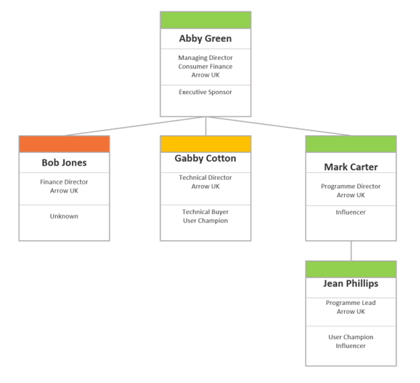

# Organisation Mapping
Understanding the structure within a customer organisation is vital for effectively delivering value in any engagement. Organisation mapping provides a structured technique for visualising the relationships between stakeholders.  

## The Process
Think of your customers:  
1. Collect the name and role of all customer staff that are stakeholders and influencers for your current engagement. Expanding your scope to the wider organisation, its suppliers and its customers can also be useful.    
   
2. Name that person’s relationship to your engagement, one or more of:  
    a. ** User ** - a day to day user or consumer of the service - this can be any level of seniority.  Day to day interaction with our services is important.  
    b. ** User Champion ** - a day to day user of the service who is an evangelist and supporter.  They will be willing to share that view internally and possibly externally too.  
    c. ** Economic/Technical/User Buyer ** - Someone who has a say in the business or technical suitability of the service to meet the customer’s needs.  Both the economic and technical buyers of the system need to be satisfied.  
    d. ** Influencer ** - someone who isn’t the outright decision-maker for the engagement, but they do have significant sway on decision making.  
    e. ** Executive Sponsor ** - someone who has a vested interest in the engagement and is likely to be trying to drive business results to achieve valuable outcomes.  
    f. ** Unknown ** - a placeholder for people that need to be better understood.  

3. Quantify how the stakeholder views this engagement as one of the following:
    a. ** Promoter ** - They have a tendency to say great things about the engagement.  They see and share with others the value that the service provides.  They are constructive and supportive when things go wrong.  
    b. ** Passive ** - They rely on what others say and not have a strong view on the engagement one way or another.  
    c. ** Detractor** - They are generally pessimistic about the engagement and would prefer that objectives were achieved differently, or they do not agree with the goals at all.  

## A Worked Example
Applying this process to multiple fictitious customer stakeholders and arranging them in an organisational chart, we get:  

The executive sponsor and economic buyer, Abby Green is a promoter of the engagement.  This work has really helped her accelerate the delivery of new features to customers, is helping her to unlock increased customer engagement and therefore, increase revenue.  She hears largely positive feedback from her team.    

Gabby Cotton is largely passive.  She’s got bigger demands on her time right now and while this engagement doesn’t hinder her objectives, long-term she would prefer effort was devoted to other initiatives to pay back technical debt and drive down her operational costs.    

Mark Carter is a big exponent of the work.  He hears good things from Jean and he is able to roll out new initiatives more quickly with this engagement underway.  He likes the quality of the work and finds clear ways of working refreshing.  

Jean Phillips is a huge fan of the engagement as it has not only helped her deliver on her objectives but helped her team skill up too.  As the staff member who feels the most direct impact, she is a huge influencer and represents the customers’ customer very strongly.  She’s had a big influence on Mark, who in turn, influences Abby.   

Bob Jones was hired after the engagement started, and while he is new to the company he has been in the industry for a long time and has some alternative view on how the work should be done.  We will need to work to get close to Bob and understand his motivations to ensure he feels represented and bought into the engagement.  

## Additional Materials  
### Supporting Processes  
Organisation Mapping should be supported by two other processes that help you to understand your customer and their objectives better.

- [Stakeholder Mapping](./../consultancy/stakeholder-mapping)
- [Value Mapping](./../consultancy/value-mapping)
