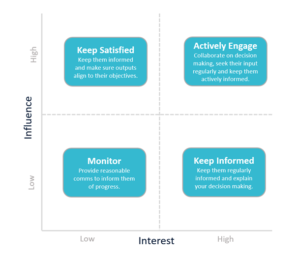

# Stakeholder Mapping
The Feedback Wrap is a structured approach for constructing helpful, effective feedback.  Taken from an Agile Leadership approach called Management 3.0, it is a technique that maximises the chance of feedback having the best outcome for both the person giving the feedback and the person receiving the feedback. In short, the Feedback Wrap helps you give better feedback.

##  Introduction

### Why conduct stakeholder mapping and analysis?
Understanding who the decision-makers and influencers are during an engagement is essential if we want to do a good job and deliver the results they expect.

### What is stakeholder mapping and analysis?  
Stakeholder mapping is a structured technique for documenting the interests, requirements, influence, positions, relationships and objectives of everyone involved in an engagement so that we know where to focus our efforts and how to engage with those stakeholders.  

### When should stakeholder mapping and analysis be performed?  
Consultants should always do stakeholder mapping and analysis at the start of an engagement, ideally in collaboration with customers. The project team should review the stakeholder map periodically and repeat the process if significant changes in organisational structures or engagement objectives have occurred.

## The Process

### Performing Stakeholder Mapping
The process of stakeholder mapping is pretty simple:

1. List all of your possible stakeholders and influencers for your engagement.  
    a. Remember to consider ALL stakeholders regardless of how senior they are, what role they fulfil, how long they have been here or where they work.  Consider customers, suppliers and integrators as well as employees working on this engagement and employees elsewhere in the organisation.  
2. Record what category of stakeholder they are, internal or external.  
3. Record what type of stakeholder they are; User, User Champion, Economic/Technical/User Decision Maker, Influencer, Executive Sponsor, Unknown.  
4. Record the stance of each stakeholder towards the engagement; Promoter, Passive or Detractor  
5. Prioritise all your stakeholders against a stakeholder matrix, rating their interest and influence between 0 and 10.  
6. Identify areas of conflict each stakeholder feels (eg towards another stakeholder, towards another business area, towards the initiative or with objectives)  
7.  Align stakeholders with a Value Map and an Org. Chart (see Additional Materials)  
   
See the following sections for a detailed examination of how to determine the category, type, interest, influence and stance of stakeholders.

## Additional Details  

### Categories of stakeholders  
There are usually two different categories of stakeholder in an engagement.  Internal stakeholders typically have more influence, but if the objective of the work is to deliver systems, functionality or processes to support or engage external stakeholders, their needs become more influential.  

| Internal Stakeholders | External Stakeholders |
|-----------------------|-----------------------|
| People within the organisation who are directly involved and have a direct impact on the engagement. | People outside the organisation who have an indirect influence on the engagement or its internal stakeholders. |
| E.g. Employees, Managers, Shareholders, Users | E.g. Suppliers, Users/Customers, Partners, Government, Trade Association, Community |

Types of stakeholders
There six main types of stakeholder during an engagement.

| Type of Stakeholder | Description | 
|---------------------|-------------|
| User | A day to day user or consumer of the service the engagement provides - this can be any level of seniority.  Ultimately, if users are not happy, they will not use the service and effort exerted in its development may be wasted. |
| User Champion | A day to day user of the service who is an evangelist and supporter. They are usually willing to share their view internally and possibly externally too. Getting these influential users on-side by considering their needs will help the adoption of your service. | 
| Economic/Technical/User Buyer | Someone who has a say in the business, financial or technical suitability of the service to meet the consumers’ needs.  All types of buyer need to be satisfied. Without the engagement of these stakeholders, the development isn’t going to be approved. |
| Influencer | Someone who isn’t the outright decision-maker for the service, but they do have a significant say on its direction, implementation and definition of success. Influencers may not be the final decision maker, but they can often help convince economic, technical or user buyers. |
| Executive Sponsor | Someone who has a vested interest in the success of the service and is likely to be trying to drive the service to achieve valuable business outcomes. These stakeholders often have high influence and high interest and can sometimes overrule other stakeholders for the sake of strategic objectives. |
| Unknown |A placeholder for people that need to be better understood. |

### Stakeholder Stance
It is important to remember that stakeholders are not guaranteed to have a favourable opinion of the engagement or the associated work. Understanding a stakeholders stance towards the engagement can be useful in determining how to work with them. Stances are mapped to one of the following three positions:

| Stance | Description | 
|--------|-------------|
| Promoter | They generally say great things about the engagement.  They see the value that the work provides and share that opinion with others.  They are constructive and supportive when things go wrong and work to find solutions to problems. | 
| Passive | They generally accept what others say and do not have a strong view on the engagement either way. |
| Detractor | They are generally sceptical about the engagement and would prefer that objectives were achieved differently, or they do not agree with the goals at all. |

### Prioritisation of Stakeholders
Plotting stakeholders on a Influence and Interest grid (formally called Mendelow’s Stakeholder Matrix) will provide a clue as to how consultants should interact with them during an engagement to best suit their situation.

When plotting a stakeholder on the matrix, consider how much interest in and influence over the engagement each stakeholder has.  Using a numeric scale for levels of influence and interest will make it easier to record this information.

| Interest | Influence | 
|----------|-----------|
| How much will the stakeholder care about the decisions made in the engagement?  | How much will our decisions impact on their day to day work and their long term objectives? |
| How much can the stakeholder dictate that the team takes a particular approach when performing the engagement? | How much say does the stakeholder have in defining the objectives and measures of success of the engagement? |

### Essential Questions to ask during Stakeholder Mapping
There are some useful questions to ask both yourself and your stakeholders during the mapping process.   
Note that some of these questions may cause debate amongst stakeholders, and you may run into internal politics. These can be difficult conversations, but it’s best to clarify the answers to these questions at the start of an engagement to avoid confusion later:

** Identifying Stakeholders **
   * Who is paying for the project?  
   * Who will benefit from the output of the project?  
   * Who will directly work on the project? 
   * Who are the subject matter experts (SME’s) / Domain experts?  

** Quantifying Interest **  
   * What benefit does the stakeholder expect to get from this project?  
   * How will this benefit be measured and evidenced?  
   * What changes will the stakeholder need to make because of this project?  
   * Are there any conflicts amongst stakeholders? Why? 
   * How can they be resolved? What problems does this project solve or create for the stakeholder?  

** Quantifying Influence **
   * What authority does the stakeholder have in the organisation?  
   * What influence does the stakeholder have in the organisation?  
   * Who controls the project assets and people? How much impact could this stakeholder have on the success of the project?

## Additional Materials  
### Supporting Processes  
Stakeholder Mapping should be supported by two other processes that help you to understand your customer and their objectives better.

- [Value Mapping](./../consultancy/value-mapping)
- [Organisation Structure Mapping](./../consultancy/organisation-mapping)
