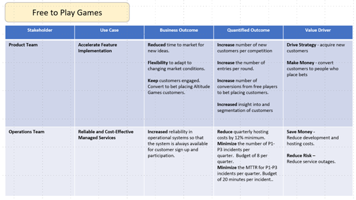

# Value Mapping
Value mapping is an approach that connects our services and activities to a successful business outcome, which in turn links that a key value driver for the customer.  Ideally, this connection will be very clear and quantifiable.  

## The Process
Start with a key stakeholder or group of key similar stakeholders in mind (repeat for each stakeholder):  
1. What is the service/engagement/project they are undertaking? Name it.
2. Who are the stakeholders? Make a note of the function that uses it and the role of the most senior individual involved.  
3. What is THEIR use case? This may be different from the service identified in step (1) and more specific.  
4. What business outcome are they trying to achieve?  
5. Is it quantifiable? If so, what quantified outcomes are being targeted vs achieved?  
6. Connect it to one of the 4 Value Drivers   
    a. Make Money
    b. Save Money
    c. Reduce Risk
    d. Drive Strategy

## A Worked Example
1. ** Customer: ** Altitude Betting and Gaming
2. ** The project they are undertaking: **  Mobile and Web Free to Play Games
3. ** Stakeholders: **  
    a. Mary Green - Technology Director (Gaming)  
    b. Tony Williams - Managing Director (Altitude Betting and Gaming UK)  
4. ** Their use cases: **  
    a. Accelerated feature implementation.   
        Add features faster and with more reliability.  
    b. Cost-effective and reliable managed services.  
        Host services for reduced costs with fewer incidents.  
5. ** Business outcomes **  
    a. Reduced time to market for new ideas to attract new customers.  
    b. More flexibility in adapting to changing market conditions to keep customers engaged and converting to bet placing Altitude customers.  
    c. More reliable hosting so that the system is always available for customer sign up and participation.   
6. ** Quantifiable ** 
    a. Increase the number of new customers per competition.  
    b. Increase the number of entries per round.  
    c. Increase the number of conversions from free players to bet placing customers.  
    d. Increased insight into and segmentation of customers - to target different types of customers and drive engagement with specific demographics.  
    e. Reduce quarterly hosting costs.  
    f. Minimise the number of P1-P3 incidents per quarter.  
    g. Minimise the MTTR for P1-P3 incidents per quarter.  
7. ** Connection to Value Drivers **  
    a. ** 1 - Drive Strategy - ** acquire new customers.   
    b. ** 2 - Make Money - ** convert customers to people who place bets.  
    c. ** 3 - Save Money - ** reduce hosting and development costs.   
    d. ** 4 - Reduce Risk - ** reduce service outages.   

## Additional Materials  
### Supporting Processes  
Value Mapping should be supported by two other processes that help you to understand your customer and their objectives better.

- [Stakeholder Mapping](./../consultancy/stakeholder-mapping)
- [Organisation Structure Mapping](./../consultancy/organisation-mapping)

